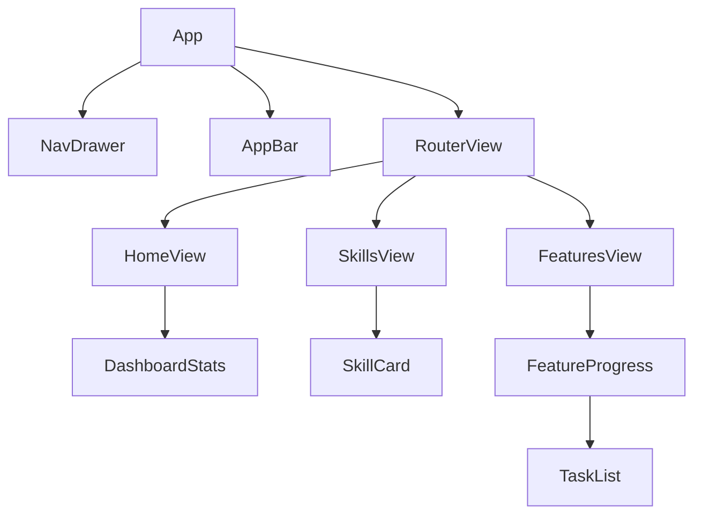

# Technical Plan: Premium UI v2

## Architecture
The UI will be a standalone Vue 3 SPA (Single Page Application) located in the `ui/` directory. It will read data from the project's metadata files (like `STATE.md`, `pyproject.toml`, and `.specs/`) or from a local JSON bridge if needed. For now, it will focus on a static-generated or locally-served frontend.

## Directory Structure
```
ui/
├── public/
├── src/
│   ├── assets/
│   ├── components/
│   │   ├── DashboardStats.vue
│   │   ├── SkillCard.vue
│   │   ├── FeatureProgress.vue
│   │   └── TaskList.vue
│   ├── views/
│   │   ├── HomeView.vue
│   │   ├── SkillsView.vue
│   │   └── FeaturesView.vue
│   ├── App.vue
│   └── main.ts
├── package.json
└── vite.config.ts
```

## Data Integration
- **Skills**: Read from the repository root (folders containing `SKILL.md`).
- **Features/Tasks**: Read from `.specs/features/**/tasks.md` and `plan.md`.
- **Global State**: Read from `.specs/project/STATE.md`.

## Implementation Steps
1.  Initialize Vue 3 project using Vite in `ui/`.
2.  Install Vuetify 3 and MDI.
3.  Configure the basic layout (Navigation drawer, App bar).
4.  Implement a script to "distill" project data into a `data.json` for the UI to consume (or use a local dev server that can serve these files).
5.  Build the Dashboard, Skills, and Features views.
6.  Add premium styling (Dark mode, transitions).

## Mermaid Diagrams

### UI Component Hierarchy

