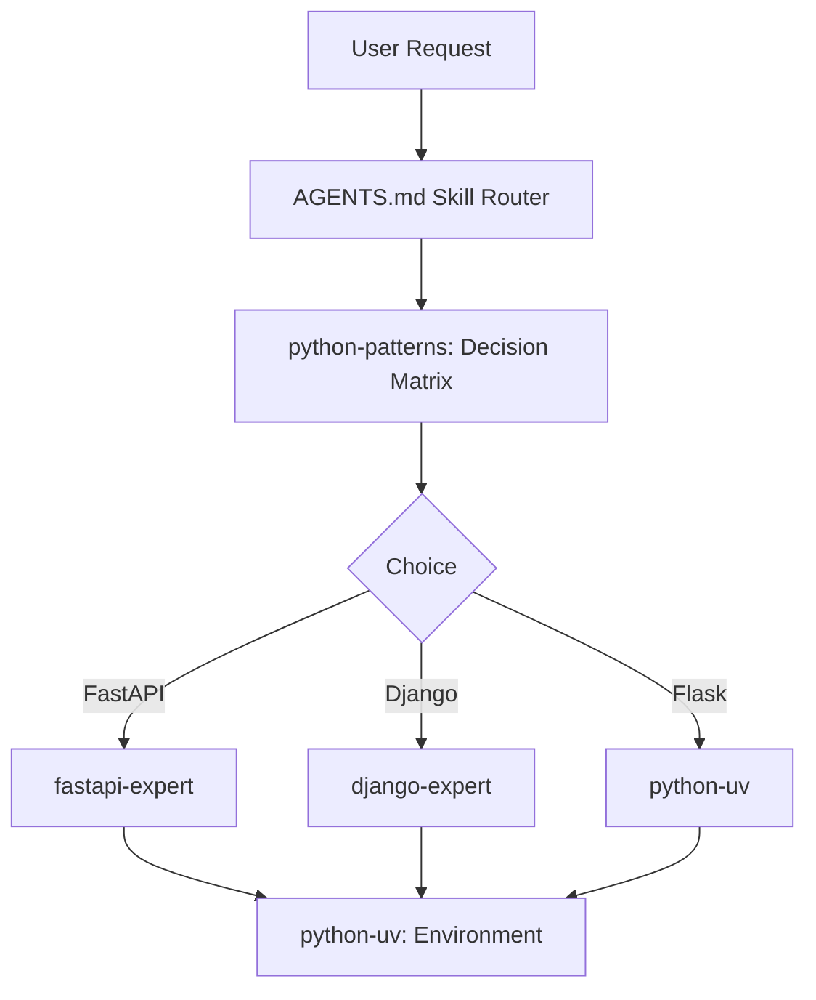

# Plan: Python Patterns Integration

## Architecture
The integration follows the standard Skill Hub architecture:
1. **Skill Definition**: A new directory in `.agents/skills/`.
2. **Global Integration**: Updating root governance files to reference the new skill.
3. **Mandate Enforcement**: Adding the skill's core principles to the project-wide mandates.

## Implementation Steps

### 1. Skill Creation
- Create `.agents/skills/python-patterns/SKILL.md` using the provided content.
- Ensure YAML frontmatter is correct for dashboard parsing.

### 2. Core Governance Update
- Modify `AGENTS.md` Skill Router:
    - Update "Python & Environment" row to include `python-patterns`.
- Modify `.specs/codebase/GLOBAL_MANDATES.md`:
    - Synchronize with `AGENTS.md` and add Python Patterns principles.

### 3. Documentation Update
- Modify `README.md`:
    - Add `python-patterns` to "Languages & Frameworks".
    - Update the Mermaid Knowledge Map.

### 4. Verification
- Validate markdown syntax.
- Check metadata consistency.

## Mermaid Flow


<!-- @sdd-state -->
```yaml
version: "2.3.0"
feature_id: "python-patterns-integration"
phase: "SPECIFY"
status: "IN_PROGRESS"
last_update: "2026-05-09T00:12:00Z"
evidence_checksum: "NONE"
```
