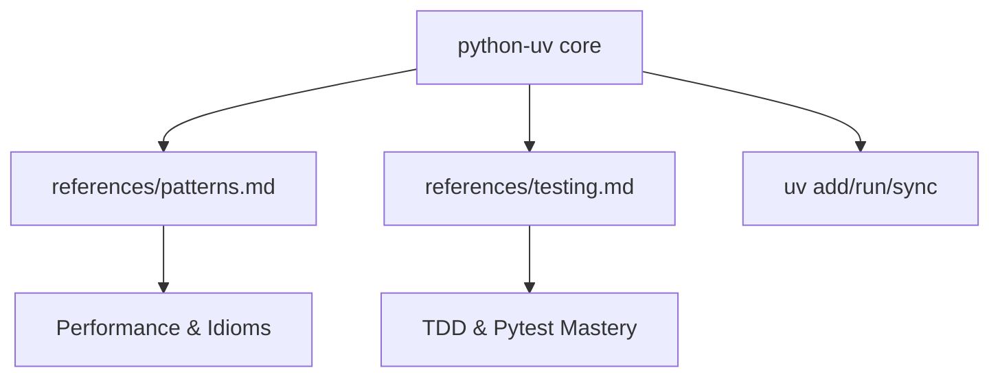

# Technical Plan: Python Expert Enrichment (python-uv)

## Arquitetura de Conhecimento
A skill será expandida de um gerenciador de ambiente para uma skill de nível "Expert" que engloba o ciclo de vida completo do desenvolvimento Python.

### Estrutura de Arquivos
```text
python-uv/
├── SKILL.md                 # Ponto de entrada atualizado
├── references/
│   ├── patterns.md          # [NOVO] Padrões idiomáticos e performance
│   ├── testing.md           # [NOVO] Guia avançado de Pytest e TDD
│   ├── python-environment.md # Existente
│   └── ...
└── examples/
    ├── patterns/            # [NOVO] Snippets de código idiomático
    └── testing/             # [NOVO] Exemplos de testes e mocks
```

## Etapas de Implementação

### 1. Preparação (Discovery)
- [x] Ler conteúdo externo de `python-patterns` e `python-testing`.
- [x] Identificar lacunas na skill `python-uv` atual.

### 2. Criação de Referências (Enrichment)
- [x] **references/patterns.md**:
    - Traduzir e adaptar padrões de legibilidade, EAFP, Type Hints e Performance.
    - Incluir exemplos de Context Managers e Dataclasses.
- [x] **references/testing.md**:
    - Traduzir e adaptar ciclo TDD, Fixtures, Mocking e Async.
    - Definir metas de cobertura (80%+).

### 3. Atualização do Core
- [x] **SKILL.md**:
    - Elevar versão para 3.0.0.
    - Adicionar seções de "Expert Knowledge" apontando para as novas referências.
    - Expandir "Best Practices" com os novos aprendizados.

### 4. Validação e Registro
- [x] Validar integridade da skill (Hooks SDD).
- [x] Atualizar `CHANGELOG.md` da skill.
- [x] Atualizar `STATE.md` e `LEARNINGS.md` do projeto.

## Riscos e Mitigações
- **Risco**: Duplicação de conteúdo entre `python-uv`, `fastapi-expert` e `django-expert`.
- **Mitigação**: Manter `python-uv` como a base de linguagem e testing puro, delegando padrões específicos de web para as outras skills.

## Diagrama de Fluxo (Mermaid)

