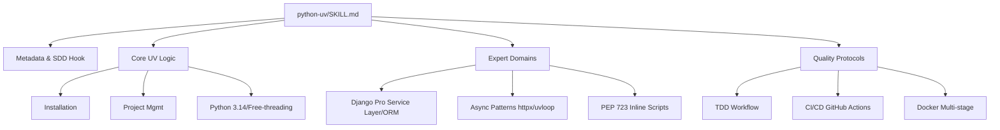

# Plan: Python UV Expert (v2.2.0 Purist Refactor)

## Architecture of `SKILL.md`

A skill será estruturada como um motor de governança purista, dividida em camadas lógicas:

1.  **Frontmatter (YAML)**: Metadados, versão (v2.2.0), tags e descrição.
2.  **SDD Hook**: Seção obrigatória de pré-requisitos.
3.  **Core Knowledge (Knowledge Base)**:
    - Comandos UV fundamentais.
    - Gestão de ambiente e Python 3.14.
4.  **Specialized Domains**:
    - **Django Pro**: Sub-seção com padrões de Service Layer e Performance ORM.
    - **Async Mastery**: Padrões de concorrência e loops rápidos.
5.  **Operational Workflows**:
    - Inicialização de Projetos.
    - Pipeline de Qualidade (TDD + Ruff + Mypy).
    - CI/CD & Docker.
6.  **Prohibitive Mandates**: Anti-padrões e regras de ouro.

## Mermaid Diagram: Skill Topology

## Schema: Mapping References

| Seção na Skill | Arquivo de Referência Origem |
|----------------|---------------------------|
| Django Pro | `references/django-workflow.md` |
| Async Development | `references/async-development.md` |
| Python 3.14 | `references/python-environment.md` |
| PEP 723 | `references/inline-script-metadata.md` |
| CI/CD & Docker | `references/ci-cd-workflows.md` |
| Quality/Testing | `references/testing.md` |

## Implementation Strategy
- Utilizar o template de `skill-factory` para garantir consistência.
- Traduzir e adaptar o conteúdo das referências para um formato de "Instruções de Expert" (imperativo, direto, denso).
- Garantir que todos os links para arquivos locais de `references/` e `examples/` funcionem.
