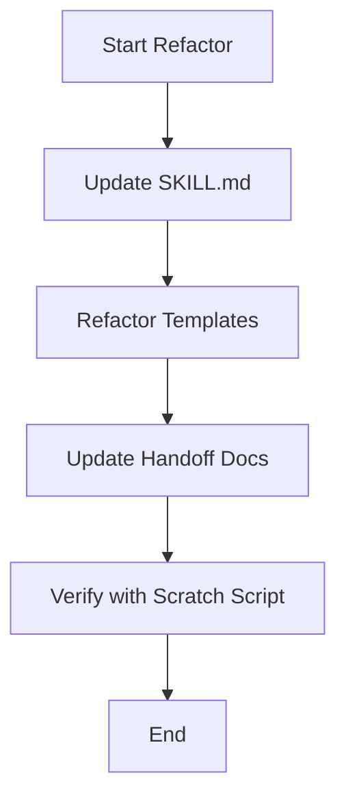

# Plan: SDD Observability Refactor

## 1. Architecture & Design
We are introducing a "Metadata Layer" within Markdown files. This layer is hidden from standard rendering (using HTML comments) but accessible to parsers.

### Metadata Block Structure
```markdown
<!-- @sdd-state -->
```yaml
version: "2.3.0"
# ... (fields)
```
```

## 2. Execution Steps

### Step 1: Core Skill Update (`sdd/SKILL.md`)
- Update version to `2.3.0`.
- Add "Section 7: Observable Governance".
- Explicitly state the requirement for metadata blocks in all outputs.

### Step 2: Template Refactoring (`sdd/resources/`)
- **tasks-template.md**:
    - Add `Evidence` column.
    - Add example of how to fill the evidence field (commit hash, test log).
- **spec-template.md**:
    - Add metadata block at the end.
- **plan-template.md**:
    - Add metadata block at the end.

### Step 3: Handoff Protocol Update (`sdd/references/handoff-protocol.md`)
- Add a step to verify metadata integrity during handoff.

### Step 4: Verification
- Create a scratch script `verify_metadata.py` to test parsing of the new format.

## 3. Mermaid Flow

