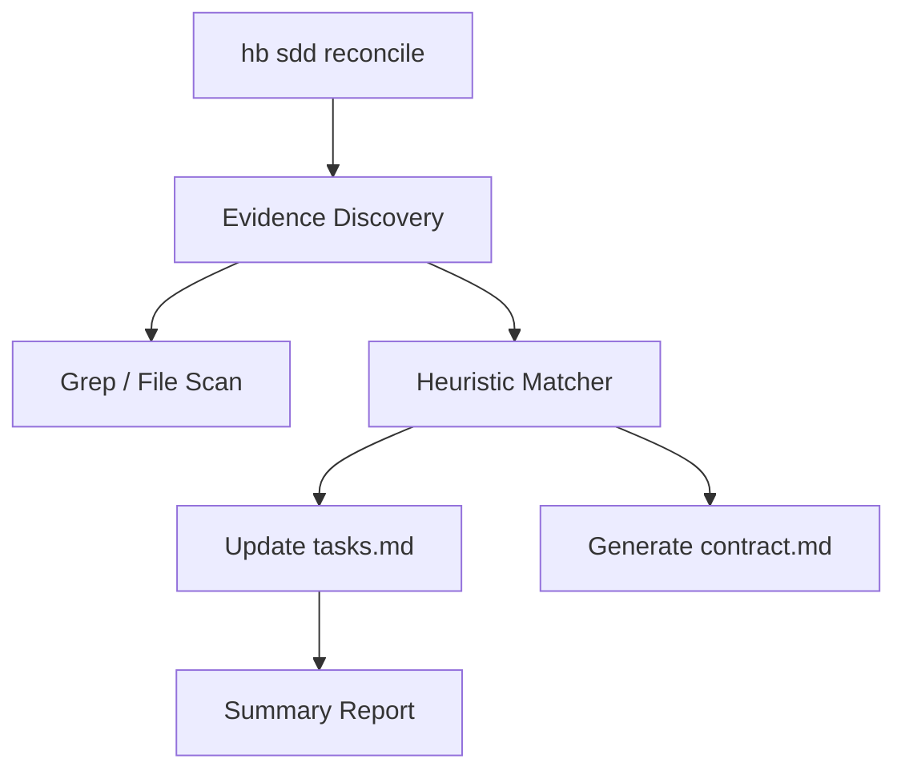

# Implementation Plan: SDD Reverse Reconciler

## Architecture

### 1. CLI Layer
- Subcommand `reconcile` in `hb/cmd/sdd.go`.

### 2. Domain Layer (`hb/internal/sdd/reconciler.go`)
- `ReconcileFeature(root, feature string) error`
- `HeuristicMatcher`: Logic to match task descriptions with codebase evidence.

### 3. Logic Detail
- **Heuristics**:
    - Task "- [ ] Implement scanner.go" -> Check for `scanner.go`.
    - Task "- [ ] Add audit command" -> Check for `Use: "audit"` in `hb/cmd/`.
- **Updates**:
    - Rewrite `tasks.md` with new states.
    - Create `contract.md` with identified symbols.

## Mermaid Diagram

