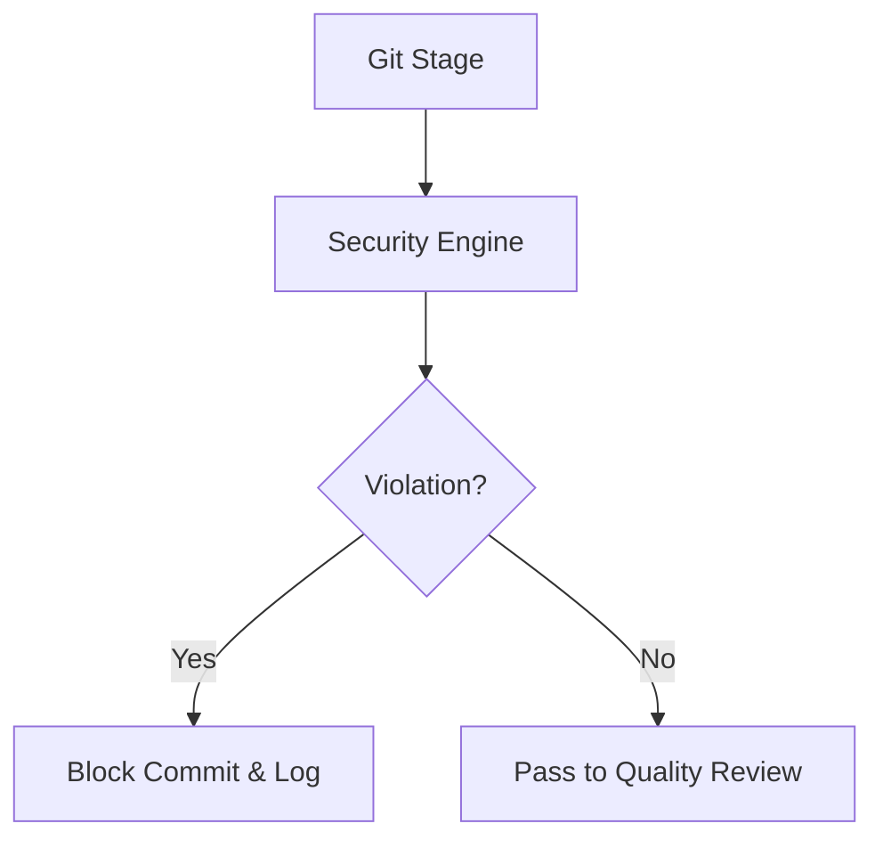

# Technical Plan: Security Guardrails

## Architecture
1. **Scanner Engine**: A regex-based engine to scan diffs for sensitive patterns.
2. **Rule Registry**: A collection of security rules (Secret patterns, PII regex).
3. **Audit Logger**: A persistent log of all security events in `.specs/security/audit.log`.

## Implementation Details
- Add `internal/security` package to `hb` CLI.
- Integrate the scanner into the `hb review` workflow as a mandatory gate.
- Use the `UIManager` to display "Security Blocked" alerts.

## Mermaid Diagram

