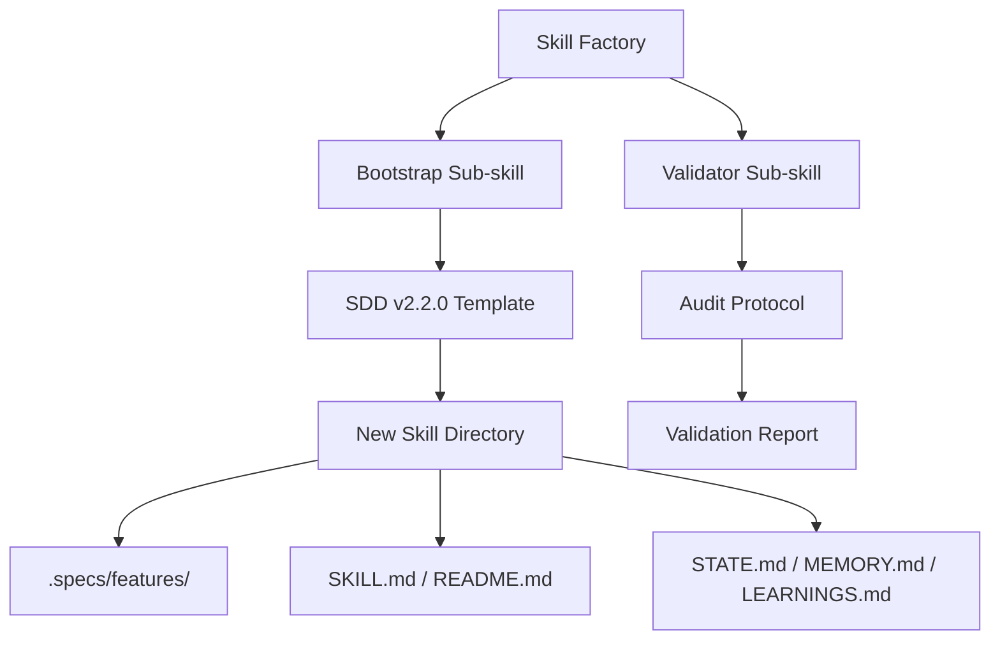

# Plan: Skill Factory Reconstruction

## 1. Architecture Overview

The Skill Factory operates as a meta-skill. It doesn't build features, it builds the *capacity* to build features by generating other skills.

## 2. Components

### 2.1 Skill Factory (Main)
- **Role**: Orchestrates the creation and validation process.
- **Protocol**: Follows the 4-Phase SDD workflow.

### 2.2 Skill Factory Bootstrap
- **Logic**: Use `hb skill new <name>` (or manual directory creation if HB is unavailable) to create the folder structure.
- **Templates**: Ensure that every file has at least a basic structure (no empty files).

### 2.3 Skill Factory Validator
- **Logic**: Check for:
    1. Presence of `SKILL.md` with correct frontmatter.
    2. Existence of memory artifacts.
    3. Compliance with "Knowledge Verification Chain".

## 3. Directory Mapping

The `skill-factory` directory will be updated as follows:
- `SKILL.md`: The main brain.
- `skill-factory-bootstrap.skill.md`: Scaffolding instructions.
- `skill-factory-validator.skill.md`: Audit protocols.
- `resources/templates/`: Base templates for new skills.

## 4. Tasks

1. [ ] Reconstruct `SKILL.md` with SDD v2.2.0 patterns.
2. [ ] Reconstruct `skill-factory-bootstrap.skill.md`.
3. [ ] Reconstruct `skill-factory-validator.skill.md`.
4. [ ] Create a "Gold Standard" template in `resources/templates/`.
5. [ ] Update `README.md` and `MEMORY.md` for the factory itself.
