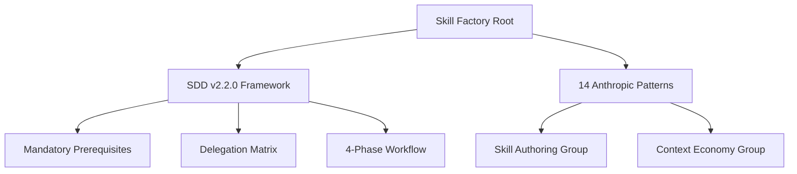

# Plan: Skill Factory v2.2 Upgrade

## 1. Architecture Synthesis

We will wrap the existing Pattern Group logic from v2.0.0 into the SDD v2.2.0 Operational Framework.

## 2. Implementation Steps

### 2.1 SKILL.md (Root)
- Update version to v2.2.0.
- Add `🔒 Prerequisites (Mandatory)` section.
- Add `🧩 Delegation Matrix`.
- Add `🔄 4-Phase Workflow` (Discovery, Specify, Implement, Verify).
- Add `🛠️ Operational Protocols` (Safety Valve, Knowledge Verification Chain).
- Keep the "Group 1-5" pattern definitions as the "Authoring Core".

### 2.2 Sub-skills (Purist Refactor)
- Update `skill-factory-bootstrap.skill.md` to remove CLI focus and use logic-first scaffolding.
- Update `skill-factory-validator.skill.md` to align with the new audit score system.

## 3. Tasks

1. [ ] Implement `SKILL.md` v2.2.0 (Root).
2. [ ] Implement `skill-factory-bootstrap.skill.md` (Root).
3. [ ] Implement `skill-factory-validator.skill.md` (Root).
4. [ ] Verify Root integrity and Slop-Free design.
