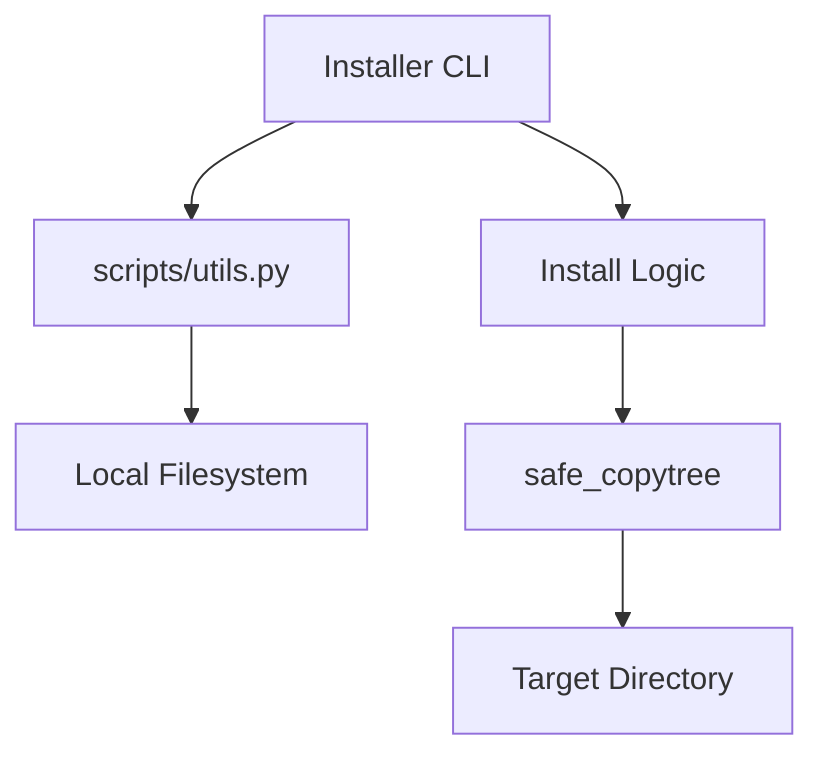

# Technical Plan: Skill Installer CLI

## 🏗️ Arquitetura
O instalador será um script Python independente que consome a API do `scripts/utils.py`.

## 🛠️ Design de Implementação

### Componentes Principais:
1.  **Command Parser**: Usar `argparse` para gerenciar comandos (`list`, `install`).
2.  **Skill Resolver**: Utilizar `get_all_skills()` para validar a existência da skill solicitada.
3.  **Installation Engine**:
    *   Verificar se o diretório de destino existe.
    *   Resolver dependências lendo o campo `uses` ou `dependencies` no frontmatter (opcional para V1).
    *   Executar `safe_copytree`.

### Comandos:
- `python scripts/installer.py list`: Lista skills e versões.
- `python scripts/installer.py install <name> [--target <path>] [--force]`: Instala skill.

## 💾 Estrutura de Dados
Não requer banco de dados. Opera sobre o sistema de arquivos.

## 🏁 Milestones
1.  [ ] Setup do Argparse e comando `list`.
2.  [ ] Implementação da lógica de `install`.
3.  [ ] Integração com `safe_copytree` do `utils.py`.
4.  [ ] Testes de instalação em diretório temporário.
