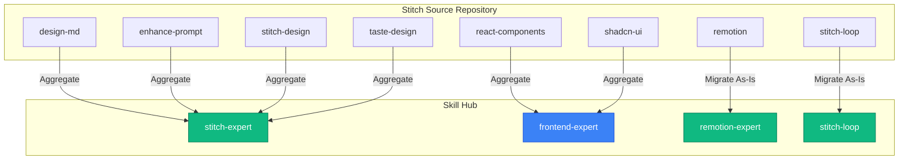

# Technical Plan: Stitch Skills Integration

## 1. Architecture & Strategy

The integration will follow a **"Hub Consolidation Strategy"** where overlapping responsibilities are merged to prevent context saturation, while unique workflows are isolated into new skills.

### 1.1 Aggregation: `stitch-expert` (New)
**Sources:** `stitch-skills-main/skills/{design-md, enhance-prompt, stitch-design, taste-design}`
**Rationale:** These four skills revolve around a single goal: orchestrating the generation of high-quality UI using the Stitch MCP. They share concepts like `DESIGN.md`, prompt enhancement, and anti-slop rules.
**Structure:**
- `SKILL.md`: A unified guide combining prompt enhancement, the "taste" principles (anti-generic UI), and design system synthesis.
- `workflows/`: `text-to-design.md`, `edit-design.md`, `generate-design-md.md`.
- `references/`: `design-mappings.md`, `prompt-keywords.md`, `tool-schemas.md`.

### 1.2 Aggregation: `frontend-expert` (Existing)
**Sources:** `stitch-skills-main/skills/{react-components, shadcn-ui}`
**Rationale:** `frontend-expert` is already responsible for React and UI component engineering. Injecting `react-components` and `shadcn-ui` knowledge directly into it improves its capabilities without creating redundant React skills.
**Structure:**
- Update `frontend-expert/SKILL.md` to include Shadcn/UI usage and Stitch HTML-to-React translation rules.
- Copy Shadcn references and scripts to `frontend-expert/resources/` and `frontend-expert/scripts/`.

### 1.3 Standalone: `remotion-expert` (New)
**Source:** `stitch-skills-main/skills/remotion`
**Rationale:** Video generation with React (Remotion) is a highly specialized domain that does not fit general frontend or design tasks.
**Structure:** 
- `SKILL.md`
- `examples/`, `resources/`, `scripts/` migrated exactly as-is.

### 1.4 Standalone: `stitch-loop` (New)
**Source:** `stitch-skills-main/skills/stitch-loop`
**Rationale:** The "baton-passing" autonomous loop is an orchestration pattern, similar to `swarm-facilitator`. It warrants its own isolated context.
**Structure:**
- `SKILL.md`
- `examples/` and `resources/` migrated as-is.

## 2. Mermaid Diagram

## 3. Schemas and Configuration
- **Skill Templates:** All new skills (`stitch-expert`, `remotion-expert`, `stitch-loop`) will be structured identically to the Hub's standard (e.g., `SKILL.md` at root, followed by `README.md`, `examples/`, `references/`, etc.).
- **Tools:** The `allowed-tools` section of each new skill will be preserved from its source.
