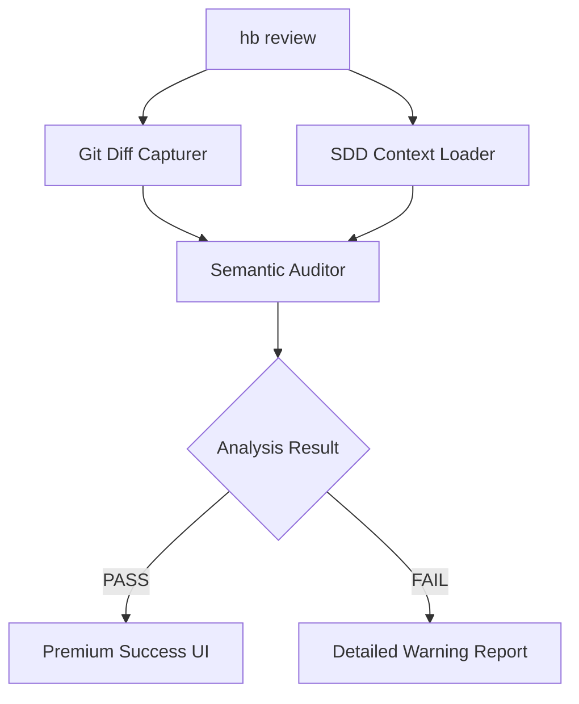

# Technical Plan: Structured Review

## Architecture
1. **Diff Capturer**: Uses `git diff --cached` via `internal/git` package.
2. **Context Provider**: Parses `tasks.md` and `plan.md` using `internal/sdd`.
3. **Semantic Auditor**: Core logic in `internal/review` using pattern matching and plan verification.
4. **UI Renderer**: Integrated into `cmd/review.go` with `internal/ui` support.

## Components
- `hb/internal/review/auditor.go`: Core logic for analyzing diffs.
- `hb/internal/git/diff.go`: Helper to interact with git and parse hunks.
- `hb/cmd/review.go`: CLI command entry point.

## Mermaid Diagram

