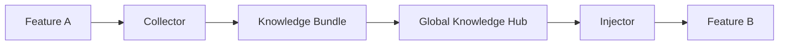

# Technical Plan: Teleport Knowledge

## Architecture
1. **Knowledge Collector**: Scans `.specs/features/[name]` for `LEARNINGS.md` and `MEMORY.md`.
2. **Bundle Engine**: Logic in `internal/knowledge/bundle.go` for JSON serialization.
3. **Global Hub**: Centralized storage in `.specs/knowledge/global/`.
4. **Knowledge Injector**: Append-only merge logic for importing bundles.

## Components
- `hb/internal/knowledge/bundle.go`: Logic for packing and unpacking knowledge.
- `hb/cmd/teleport.go`: CLI entry point.

## Mermaid Diagram

