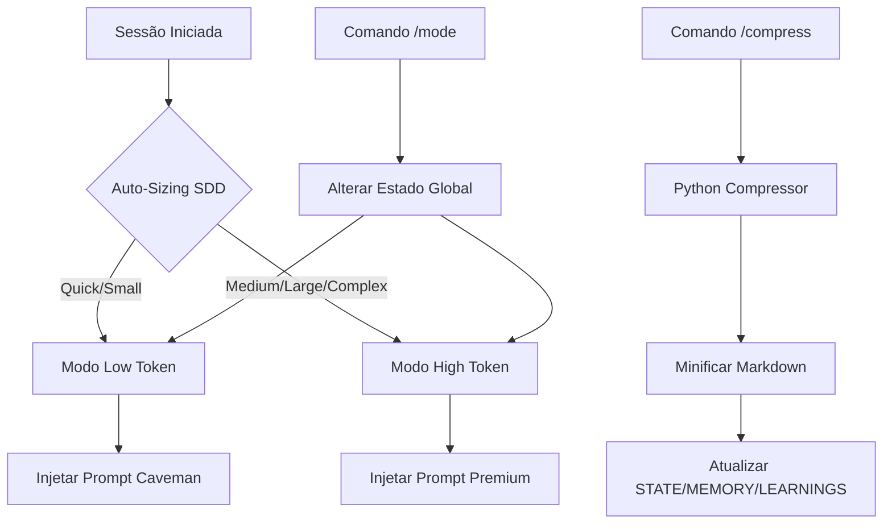
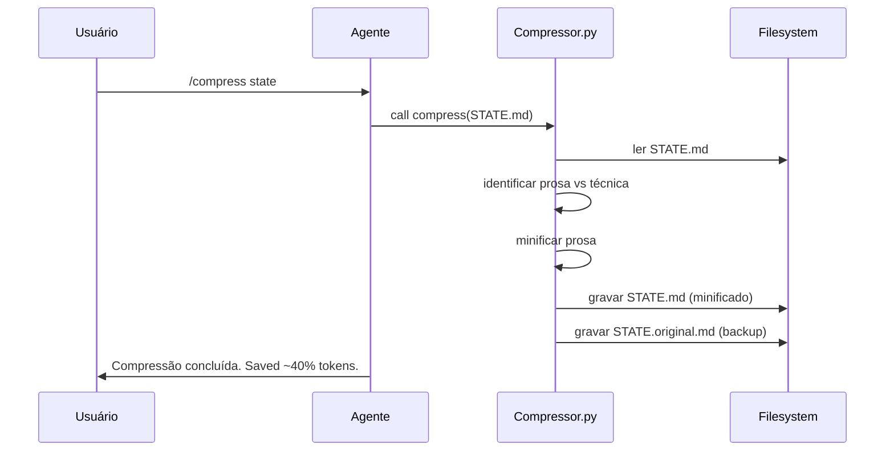

# Plano Técnico: Token Optimization & Dual Mode

## 1. Arquitetura do Sistema

O sistema será composto por um orquestrador de modo e uma ferramenta de compressão de arquivos de texto.



## 2. Componentes Principais

### 2.1. Skill: `token-distiller`
- Localizada em `skills/token-distiller/SKILL.md`.
- Contém as regras linguísticas para ambos os modos.
- Define os gatilhos de ativação.

### 2.2. Script: `compressor.py`
- Localizado em `scripts/utils/compressor.py`.
- Baseado na lógica do `caveman-compress`.
- Funcionalidade:
    - Preserva cabeçalhos, blocos de código e links.
    - Remove artigos, advérbios de intensidade e frases de preenchimento.
    - Mantém a estrutura de listas e tabelas.

### 2.3. Hook de Inicialização
- Atualizar o `onboarding-navigator` para ler o modo atual de um arquivo de configuração (`.hub-mode`).

## 3. Estrutura de Arquivos

```text
/
├── .specs/features/token-optimization/
│   ├── spec.md
│   ├── plan.md
│   ├── contract.md
│   └── tasks.md
├── scripts/
│   └── utils/
│       └── compressor.py
└── skills/
    └── token-distiller/
        └── SKILL.md
```

## 4. Estratégia de Implementação

1. **Sprint 1: Fundação**
   - Criar a skill `token-distiller` com as diretrizes de ambos os modos.
   - Implementar o script de compressão básica.
2. **Sprint 2: Integração**
   - Integrar o seletor de modo no workflow de boot do agente.
   - Adicionar comandos de barra para troca de modo.
3. **Sprint 3: Validação**
   - Testar a compressão em arquivos reais do Hub (`STATE.md`).
   - Validar se o agente mantém a precisão técnica no modo Low Token.

## 5. Diagrama de Fluxo de Compressão


