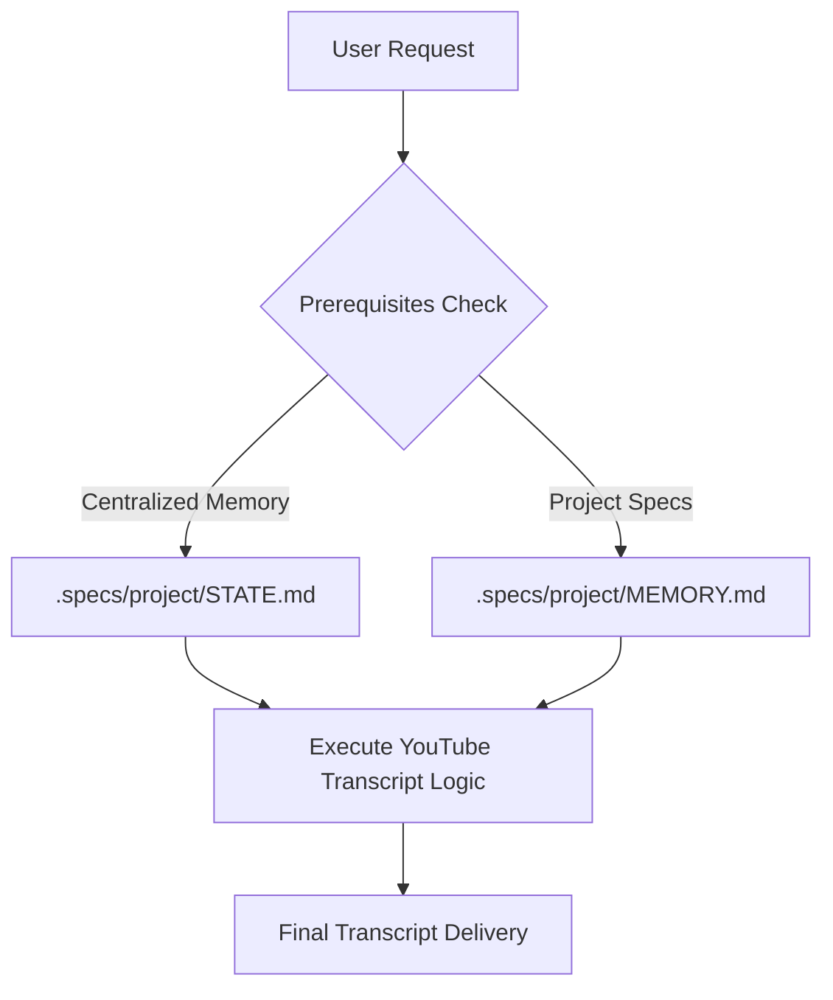

# Plan: Retrofit YouTube Transcript to SDD v2.2.0

## 🏗️ Architecture
The upgrade focuses on **Governance Refactoring**. No changes to the core `yt-dlp` or `whisper` logic are planned.

### Workflow
1.  **Cleanup Phase**: Verify and remove any local state files.
2.  **SKILL.md Refactor**: 
    - Inject `agent.md` mandated mental checklist.
    - Update memory paths to `.specs/project/`.
    - Refine activation metadata.
3.  **Documentation Sync**: Rename `SKILL-FACTORY-VALIDATION.md` to `audit-report.md` (or create a new one) and update content to reflect the new standard.
4.  **Verification**: Perform a self-audit.

## 📊 Data Flows

## 🛠️ Implementation Steps
1.  **Task 1**: Update `youtube-transcript/SKILL.md`.
2.  **Task 2**: Standardize `youtube-transcript/audit-report.md`.
3.  **Task 3**: Cleanup legacy validation files.
