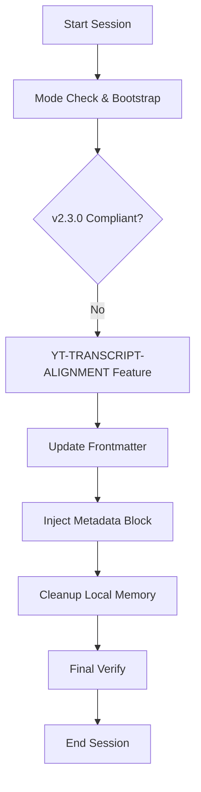

# Technical Plan: YouTube Transcript v2.3.0 Alignment

## 🏗️ Architecture Alignment
The goal is to update the `youtube-transcript` skill to comply with SDD v2.3.0 without changing its core logic (extraction and deduplication).

### Refactoring Strategy
1.  **Header Update**: Update YAML frontmatter in `SKILL.md` to `version: 2.3.0`.
2.  **Protocol Sync**: Update `🔒 Prerequisites (Mandatory)` to match the new v2.3.0 boilerplate.
3.  **Metadata Injection**: Add the `<!-- @sdd-state -->` block to the end of all relevant markdown files.
4.  **Purity Sweep**: Delete `youtube-transcript/audit-report.md`.

## 📊 Data Flow & Lifecycle (v2.3.0)



---

<!-- @sdd-state -->
```yaml
version: "2.3.0"
feature_id: "YT-TRANSCRIPT-ALIGNMENT"
phase: "VERIFY"
status: "COMPLETED"
last_update: "2026-05-06T10:27:00Z"
evidence_checksum: "NONE"
```
