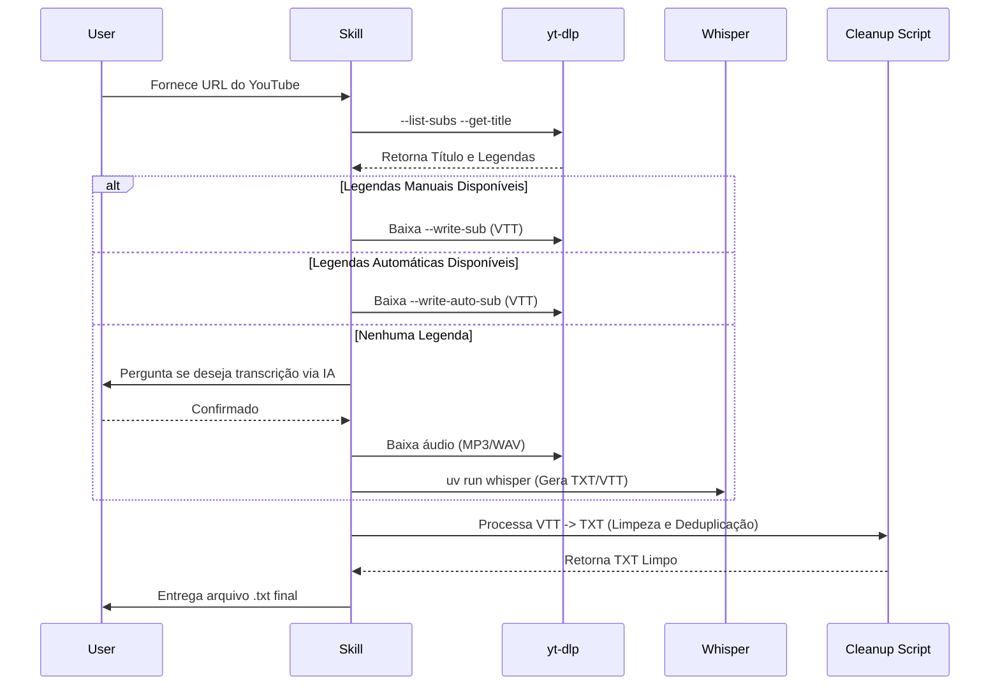

# Technical Plan: YouTube Transcript Skill

Este plano detalha a implementação da skill `youtube-transcript`, integrando ferramentas de CLI e processamento Python via `uv`.

---

## 1. Arquitetura da Solução

### Fluxo de Decisão de Transcrição (Mermaid)

---

## 2. Estratégia de Implementação

### Step 1: Scaffolding (Skill Factory)
Utilizar `skill-factory-bootstrap` para gerar a estrutura base:
- `youtube-transcript/SKILL.md`
- `youtube-transcript/README.md`
- `youtube-transcript/CHANGELOG.md`

### Step 2: Implementação do Core (Bash/Python)
- **Bash Script (na SKILL.md):** Orquestra o fluxo de CLI (`yt-dlp`).
- **Python Inline Script:** Script robusto de limpeza para tratar o formato VTT e remover redundâncias de legendas geradas automaticamente.
- **Integração UV:** Comando para garantir que `yt-dlp` e `whisper` estejam prontos.

### Step 3: Gestão de Dependências
- Verificar se `yt-dlp` está instalado (`command -v`).
- Utilizar `uv tool run` para comandos globais ou `uv run --with` para scripts locais com dependências específicas.

---

## 3. Schemas e Formatos

- **Input:** URL (YouTube)
- **Output:** `{video-title}.txt`
- **Temporary Files:** `.tmp_transcript.vtt`, `.tmp_audio.mp3`

---

## 4. Plano de Validação

1. **Teste Unitário (Limpeza):** Validar o script Python com um VTT de amostra contendo tags e duplicidades.
2. **Teste de Integração (Sem IA):** Testar com vídeo que possui legendas manuais.
3. **Teste de Integração (Com IA):** Testar com vídeo curto sem legendas, acionando o Whisper.
