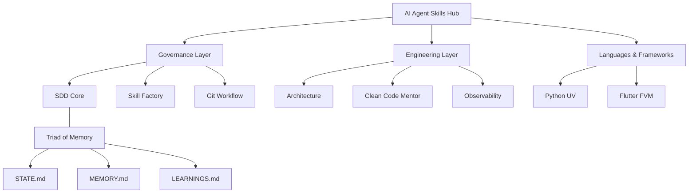

# 🧠 AI Agent Skills Hub (v6.0.0)

> **The Centralized Engine for Agentic Excellence.**  
> A modular repository of specialized "Skills" for AI agents, governed by the strict standards of **Purist SDD v2.2.0**.

---

## 📖 Project Vision

The **AI Agent Skills Hub** is designed to serve the modern developer by providing a standardized ecosystem of high-performance agentic capabilities. We move away from opaque tooling and legacy CLIs, embracing a **Logic-First** approach where governance is transparently driven by Markdown artifacts and deterministic operational mandates.

Every skill in this hub is an independent, verifiable module that ensures AI agents operate with maximum precision, security, and architectural integrity.

---

## 🏗️ Core Methodology: Purist SDD

This hub is powered by **Spec-Driven Development (SDD)**. Every development cycle follows a rigorous 4-phase protocol:

1.  **DISCOVERY**: Context rehydration from the **Triad of Memory**.
2.  **SPECIFY**: Creation of deterministic specs, plans, and contracts.
3.  **IMPLEMENT**: Atomic, task-driven execution with TDD.
4.  **REVIEW**: Formal validation against Acceptance Criteria and memory persistence.

> [!IMPORTANT]
> **The Law of SDD**: If it's not in the spec, it doesn't exist. If it's not verified, it's not done.

---

## 🧭 The Skill Hub Catalog

The hub hosts a diverse range of skills categorized to meet developer demands:

### 🛡️ Governance & Standards
- **[SDD](sdd/)**: The core framework for deterministic agentic workflows.
- **[Skill Factory](skill-factory/)**: The engine for standardizing and bootstrapping new skills.
- **[Git Workflow](git-workflow/)**: Conventional commits and atomic versioning standards.

### 🏛️ Engineering & Architecture
- **[Architecture](architecture/)**: System design, ADR management, and Mermaid visualization.
- **[Clean Code Mentor](clean-code-mentor/)**: Enforcement of SOLID, YAGNI, DRY, and KISS.
- **[Benchmark Expert](benchmark-expert/)**: Performance baselines and regression detection.
- **[Observability Expert](observability-expert/)**: SRE, OpenTelemetry, and resilient monitoring.

### 🐍 Languages & Frameworks
- **[Python UV](python-uv/)**: Modern Python management (Django, Async, PEP 723).
- **[Django Expert](django-expert/)**: Production-ready Django hardening and architecture.
- **[FastAPI Expert](fastapi-expert/)**: High-performance FastAPI implementation patterns.
- **[Flutter FVM](flutter-fvm/)**: Professional Flutter development with version management.

### 🧠 Advanced Intelligence
- **[Brainstorming](brainstorming/)**: Facilitation for complex problem exploration.
- **[Token Distiller](token-distiller/)**: Dynamic token density management (Caveman vs. Premium).
- **[YouTube Transcript](youtube-transcript/)**: High-performance extraction and data processing.

---

## 🚀 How to Use (Equipping Your Agent)

Since we prioritize **Logic-First** governance, you "equip" an agent by providing it with the Markdown instructions found in each skill's `SKILL.md` file.

1.  **Reference**: Direct your agent to read the `SKILL.md` of the desired module.
2.  **Context Rehydration**: Ensure the agent adopts the **Triad of Memory** (`STATE.md`, `MEMORY.md`, `LEARNINGS.md`) located in `.specs/project/`.
3.  **Execute**: Follow the SDD 4-Phase loop documented in the `sdd` skill.

---

## 📊 Knowledge Map

---

**Built for the next generation of Agentic Workflows.**  
Created by [Kleberson Romero](https://github.com/KlebersonCollab)

