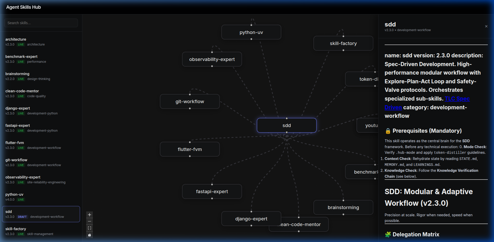
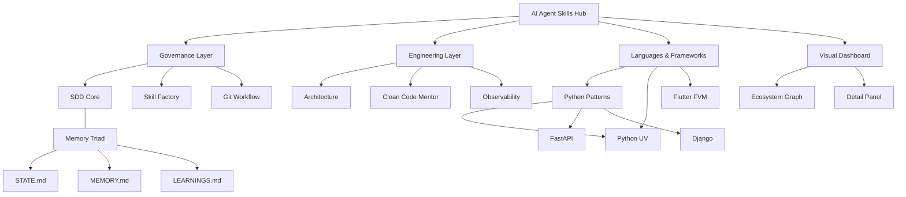

# 🧠 AI Agent Skills Hub (v6.1.0)

<div align="center">
  
  <p><em>The Centralized Engine for Agentic Excellence.</em></p>
  
  [](https://github.com/tech-leads-club/agent-skills)
  [](LICENSE)
  [](AGENTS.md)
</div>

---

## 📖 Project Vision

The **AI Agent Skills Hub** is a standardized ecosystem of high-performance agentic capabilities. We move away from opaque tooling and legacy CLIs, embracing a **Logic-First** approach where governance is transparently driven by Markdown artifacts and deterministic operational mandates.

Every skill in this hub is an independent, verifiable module that ensures AI agents operate with maximum precision, security, and architectural integrity.

---

## 🖥️ Visual Dashboard (Agent Skills Hub)

We now feature an interactive visual interface to explore and audit our skills:

- **Ecosystem Graph:** Visualize real dependencies between skills extracted directly from content and the Global Router.
- **Skill Catalog:** Quick access to technical documentation and governance state (LIVE/DRAFT).
- **Interactive Audit:** Explore prerequisites and workflow sections in real-time.

### 🕹️ Quick Commands (Dashboard)

| Command | Description |
|---------|-----------|
| `make dash-install` | Installs UI dependencies |
| `make dash-start` | Syncs data and launches the dashboard |
| `make dash-stop` | Terminates the dashboard process |
| `make dash-restart` | Restarts the visual environment |

---

## 🏗️ Core Methodology: SDD v2.3.0

This hub is powered by **Spec-Driven Development (SDD)**. Every cycle follows a rigorous 4-phase protocol:

1.  **DISCOVERY**: Context rehydration via the **Memory Triad**.
2.  **SPECIFY**: Creation of deterministic specs, plans, and contracts.
3.  **IMPLEMENT**: Atomic, task-driven execution.
4.  **REVIEW**: Formal validation against Acceptance Criteria and memory persistence.

> [!IMPORTANT]
> **The Law of SDD**: If it's not in the spec, it doesn't exist. If it's not verified, it's not done.

---

## 🧭 Skill Catalog

### 🛡️ Governance & Standards
- **[SDD](sdd/)**: The core framework for deterministic workflows.
- **[Skill Factory](skill-factory/)**: The engine for standardizing new skills.
- **[Git Workflow](git-workflow/)**: Conventional commit and atomic versioning standards.

### 🏛️ Engineering & Architecture
- **[Architecture](architecture/)**: System design, ADR management, and Mermaid visualization.
- **[Clean Code Mentor](clean-code-mentor/)**: Enforcement of SOLID, YAGNI, DRY, and KISS.
- **[Benchmark Expert](benchmark-expert/)**: Performance baselines and regression detection.
- **[Observability Expert](observability-expert/)**: SRE, OpenTelemetry, and resilient monitoring.

### 🐍 Languages & Frameworks
- **[Python Patterns](python-patterns/)**: Architectural decision-making (FastAPI vs Django, Async vs Sync).
- **[Python UV](python-uv/)**: Modern Python management (Django, Async, PEP 723).
- **[Django Expert](django-expert/)**: Production-ready Django hardening and architecture.
- **[FastAPI Expert](fastapi-expert/)**: High-performance implementation patterns.
- **[Flutter FVM](flutter-fvm/)**: Professional Flutter development with version management.

### 🧠 Advanced Intelligence
- **[Brainstorming](brainstorming/)**: Facilitation for complex problem exploration.
- **[Token Distiller](token-distiller/)**: Dynamic token density management (Caveman vs. Premium).
- **[YouTube Transcript](youtube-transcript/)**: High-performance extraction and data processing.

---

## 📊 Knowledge Map (LKG)


```mermaid
graph TD
    Hub[AI Agent Skills Hub] --> Governance[Governance Layer]
    Hub --> Engineering[Engineering Layer]
    Hub --> Lang[Languages & Frameworks]
    Hub --> UI[Visual Dashboard]
    
    Governance --> SDD[SDD Core]
    Governance --> SF[Skill Factory]
    Governance --> GW[Git Workflow]
    
    Engineering --> Arch[Architecture]
    Engineering --> CCM[Clean Code Mentor]
    Engineering --> OBS[Observability]
    
    Lang --> Patterns[Python Patterns]
    Lang --> UV[Python UV]
    Lang --> Flutter[Flutter FVM]
    
    Patterns --> UV
    Patterns --> FastAPI
    Patterns --> Django
    
    UI --> Graph[Ecosystem Graph]
    UI --> Detail[Detail Panel]
    
    SDD --- Triad[Memory Triad]
    Triad --> State[STATE.md]
    Triad --> Memory[MEMORY.md]
    Triad --> Learn[LEARNINGS.md]
```

---

<div align="center">
**Built for the next generation of Agentic Workflows.**  
Created by [Kleberson Romero](https://github.com/KlebersonCollab)
</div>

---

<!-- @sdd-state -->
```yaml
version: "2.3.0"
feature_id: "HUB-ALIGNMENT"
phase: "VERIFY"
status: "COMPLETED"
last_update: "2026-05-08T23:08:00Z"
evidence_checksum: "NONE"
```
