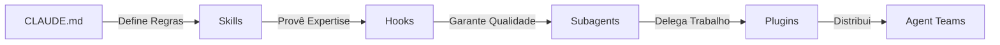

## 🔒 Prerequisites (Mandatory)
Esta skill opera dentro do framework **SDD**. Antes de qualquer execução técnica:
0. **Mode Check**: Verifique o modo operacional atual (`.hub-mode`).
1. **Context Check**: Reidrate o contexto lendo `STATE.md`, `MEMORY.md` e `LEARNINGS.md`.
2. **Layer Check**: Certifique-se de que a camada 1 (CLAUDE.md) está devidamente configurada.

---

# 🤖 The Agent Development Kit (ADK) Expert

> Guia mestre para arquiteturas agenticas baseadas no modelo de 5 camadas.

---

## 🏛️ Visão Geral da Arquitetura
O ADK é um framework estruturado para transformar modelos de linguagem em agentes de software robustos, previsíveis e escaláveis. Ele organiza as capacidades do agente em camadas lógicas:

1. **Memória** (CLAUDE.md)
2. **Conhecimento** (Skills)
3. **Guardrails** (Hooks)
4. **Delegação** (Subagents)
5. **Distribuição** (Plugins)

---

## 📦 Camada 1: Memória (The Memory Layer)
O arquivo `CLAUDE.md` atua como a **constituição** do agente. Ele deve estar sempre carregado e ativo.

- **Global (`~/.claude/CLAUDE.md`)**: Regras que se aplicam a todos os projetos.
- **Projeto (`.claude/CLAUDE.md`)**: Regras específicas do repositório atual.
- **Conteúdo Principal**:
  - Regras de arquitetura.
  - Convenções de nomenclatura.
  - Expectativas de testes.
  - Mapa do repositório.

---

## 🧠 Camada 2: Conhecimento (The Knowledge Layer)
As **Skills** fornecem expertise sob demanda. Diferente da Memória, as Skills são invocadas conforme a necessidade para manter o contexto limpo.

- **SKILL.md**: Define as instruções, scripts e templates da skill.
- **Auto-invocação**: Baseada em correspondência de descrição (Description Matching).
- **Contexto Específico**: Chunks de conhecimento modular que não sobrecarregam o prompt inicial.

---

## 🛡️ Camada 3: Guardrails (The Guardrail Layer)
Os **Hooks** garantem a qualidade e segurança de forma determinística (não-IA).

- **Eventos**: `PreToolUse`, `PostToolUse`, `SessionStart`, `Stop`.
- **Exemplos de Uso**:
  - Auto-lint ao salvar arquivos.
  - Bloqueio de comandos perigosos (ex: `rm -rf /`).
  - Notificações automáticas em canais de comunicação (Slack/Teams).

---

## 👥 Camada 4: Delegação (The Delegation Layer)
O uso de **Subagents** permite a execução de tarefas complexas em janelas de contexto isoladas.

- **Especialistas**: `code-reviewer`, `test-runner`, `explorer`.
- **Fluxo**: O agente principal delega apenas a tarefa; recebe apenas os resultados.
- **Benefício**: Mantém a janela de contexto principal limpa e evita recursividade infinita.

---

## 🚀 Camada 5: Distribuição (The Distribution Layer)
Os **Plugins** são o meio de distribuir capacidades entre times e projetos.

- **Ecosistema**: Marketplace de skills, agentes, hooks e comandos.
- **Padronização**: Pense neles como pacotes npm para capacidades de agentes.

---

## 🛠️ Ecossistema Estendido

### MCP Servers
Integração com ferramentas externas, bases de dados, APIs e GitHub. O Model Context Protocol (MCP) é a ponte que conecta o agente ao mundo exterior.

### Agent Teams
Coordenação de múltiplos agentes trabalhando em paralelo:
- **Lead Orchestration**: Um agente líder coordena os demais.
- **Message Passing**: Comunicação fluida entre especialistas.
- **Shared Permissions**: Gestão de permissões em nível de equipe.

---

## 📐 Fluxo de Execução

---

## 🚫 Proibições
- NUNCA execute tarefas técnicas de alta complexidade sem uma Skill correspondente.
- NUNCA ignore as regras estabelecidas na Camada 1 (CLAUDE.md).
- NUNCA permita que subagentes criem outros subagentes (evitar loop infinito).

---
*Gerado via Antigravity ADK-Expert v1.0.0*
