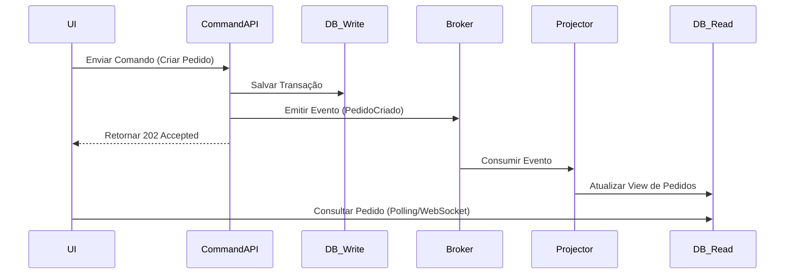

# CQRS & Event-Driven Design

Este guia detalha a aplicação de padrões de alta performance para sistemas distribuídos e escaláveis.

---

## 1. CQRS (Command Query Responsibility Segregation)

O CQRS propõe a separação entre a lógica de alteração de dados (Commands) e a lógica de leitura de dados (Queries).

- **Write Side (Commands)**: Focado em validar regras de negócio e garantir a integridade transacional. Geralmente utiliza um banco de dados normalizado ou Event Store.
- **Read Side (Queries)**: Focado em performance de leitura. Utiliza bancos de dados desnormalizados, caches ou índices de busca (ex: Elasticsearch, Redis).
- **Sincronização**: O lado de escrita notifica o lado de leitura sobre mudanças através de eventos (Projections).

**Quando usar**: Quando o volume de leitura é drasticamente superior ao de escrita ou quando as visões de dados exigem junções complexas que degradam o banco principal.

## 2. Event-Driven Architecture (EDA)

Sistemas onde a comunicação ocorre via emissão e consumo de eventos assíncronos.

- **Event**: Uma representação de algo que já aconteceu no passado (ex: `OrderPlaced`, `UserRegistered`).
- **Broker**: O intermediário que gerencia as mensagens (ex: RabbitMQ, Kafka, AWS EventBridge).
- **Producer/Consumer**: Desacoplamento total; o produtor não sabe quem consome a mensagem.

## 3. Estratégias Críticas

### A. Idempotência
Garantir que processar a mesma mensagem múltiplas vezes não gere efeitos colaterais.
- **Técnica**: Utilizar um `Unique Message ID` e checar em uma tabela de controle (`Idempotency Key`) antes de processar.

### B. Consistência Eventual
Aceitar que os dados no Read Side podem levar alguns milissegundos (ou segundos) para refletir a escrita.
- **Impacto**: O design de UI deve prever estados de "processando" ou atualizações otimistas.

### C. DLQ (Dead Letter Queue)
Fila para onde mensagens que falharam repetidamente são enviadas para análise manual ou reprocessamento posterior.

## 4. Event Sourcing (Opcional)

Em vez de armazenar o estado atual do objeto, armazena-se a sequência completa de eventos que levaram a esse estado.
- **Vantagem**: Auditabilidade total e capacidade de reconstruir o estado em qualquer ponto no tempo.
- **Desvantagem**: Alta complexidade de implementação e necessidade de `Snapshots`.

---

## Exemplo de Fluxo (Mermaid)

