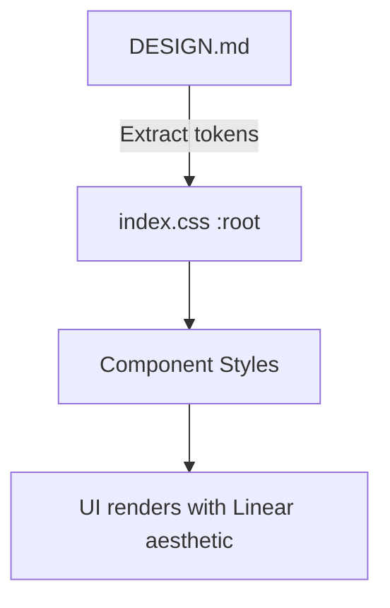

# Plan — Linear Design Redesign

## Approach
1. Add font imports in `index.html`.
2. Expand `index.css` with full design token set (colors already exist, add typography, spacing, border-radius, component classes).
3. Refactor component JSX to use new CSS classes.
4. Test and adjust.

## Architecture
- Design tokens as CSS custom properties in `:root`.
- Component-specific classes prefixed by component name (e.g., `.top-nav`, `.text-input`, `.feature-card`).
- Existing component logic unchanged; only presentational layer updated.

## Data Flow

## Dependencies
- Inter font (Google Fonts)
- JetBrains Mono font (Google Fonts)
