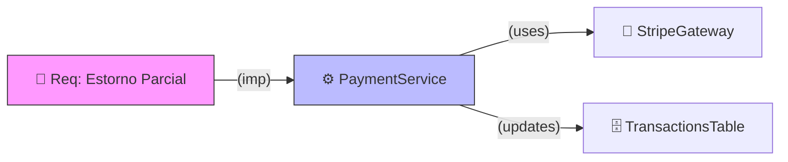

# Gold Standard Output: Knowledge Mapping

## 1. Relational Mapping (KNOWLEDGE-MAP.mermaid)

## 2. Rationale
Este output é Gold Standard porque:
- Identifica **Entidades** (Requisitos, Serviços, Gateways).
- Define **Verbos de Relação** claros (`imp`, `uses`, `updates`).
- Utiliza **Styling** Mermaid para diferenciar tipos de nós.
- Fornece uma visão de **Causa e Efeito** (Caminhamento de Impacto).
