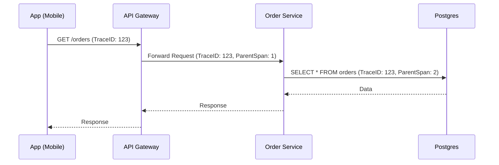

# Metrics & Tracing: The Vital Signs

Métricas e Tracing permitem entender o *desempenho* e o *fluxo* do sistema em tempo real.

---

## 1. Métricas (O "Quanto")

Métricas são agregações numéricas ao longo do tempo.

### Padrão RED (Para Serviços de API)
- **R: Rate**: Número de requisições por segundo.
- **E: Errors**: Número de requisições que falharam.
- **D: Duration**: Tempo que as requisições levaram (Latência).

### Padrão USE (Para Infraestrutura)
- **U: Utilization**: Percentual de uso (CPU, RAM).
- **S: Saturation**: Fila de trabalho extra.
- **E: Errors**: Erros de hardware ou sistema operacional.

## 2. Distributed Tracing (O "Onde")

O rastreamento distribuído segue uma requisição através de múltiplos serviços.

- **Trace**: A jornada completa de uma requisição.
- **Span**: Uma operação individual dentro do trace (ex: uma query SQL, uma chamada HTTP externa).
- **Context Propagation**: O ato de passar o `TraceID` nos cabeçalhos HTTP para que o próximo serviço possa continuar o rastro.

## 3. OpenTelemetry (OTel)

O padrão de mercado em 2026 para telemetria.

### Componentes:
1.  **SDKs**: Bibliotecas na aplicação para gerar dados.
2.  **Collector**: Um proxy que recebe, processa e exporta os dados para diferentes backends.
3.  **Protocolo (OTLP)**: O formato universal de envio de dados.

## 4. Visualização

- **Prometheus/Grafana**: O par perfeito para métricas.
- **Jaeger/Tempo**: Ferramentas para visualizar a linha do tempo dos traces.

---

## Exemplo de Propagação de Contexto (Mermaid)

