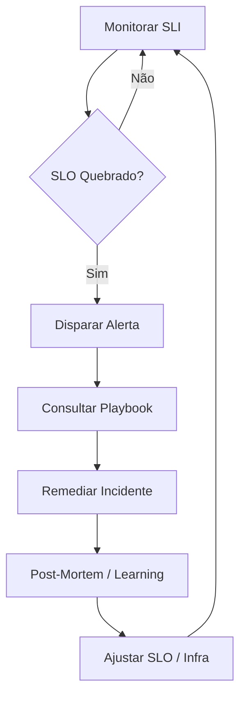

# SLIs, SLOs & Alerting: Reliability by Design

A confiabilidade não é um acidente; é uma meta de engenharia baseada em dados matemáticos e acordos de negócio.

---

## 1. Definições Fundamentais

### SLI (Service Level Indicator)
É o que você mede. Uma métrica técnica específica que indica a saúde de um componente.
- **Exemplo**: "Percentual de requisições HTTP 200 nas últimas 24h".

### SLO (Service Level Objective)
É a meta que você deseja atingir para o SLI.
- **Exemplo**: "99.9% das requisições devem retornar status 200".

### SLA (Service Level Agreement)
O contrato legal com o cliente. Se o SLA for quebrado, há consequências financeiras. Geralmente, o SLO é mais rigoroso que o SLA para dar uma margem de segurança.

## 2. Error Budget (Orçamento de Erro)

O Error Budget é a diferença entre 100% e o seu SLO.
- **SLO de 99.9%** = 0.1% de orçamento de erro.
- **Significado**: Você tem permissão para falhar ou ficar fora do ar por esse percentual sem quebrar sua meta.
- **Uso**: Utilize o orçamento de erro para decidir quando lançar novas features vs. quando focar em estabilidade. Se o orçamento está acabando, pare os lançamentos e foque em correções.

## 3. Políticas de Alerta (Alerting)

Evite a fadiga de alertas seguindo estas regras:

1.  **Burn Rate Alerting**: Alerte quando o orçamento de erro está sendo consumido muito rápido (ex: consumiu 5% em 1h). Isso é mais eficaz que alertas de picos momentâneos.
2.  **Actionable Alerts**: Todo alerta deve responder: "O que o humano precisa fazer agora?". Se não há ação imediata, deve ser um ticket no backlog, não um alerta.
3.  **Severity Levels**:
    - **P1/Critical**: Acorda alguém (ex: Pagamento fora do ar).
    - **P2/Warning**: Notifica no Slack durante o horário comercial.
    - **P3/Info**: Apenas dashboards.

## 4. Playbooks (Runbooks)

Cada alerta crítico deve ter um link para um documento de instrução contendo:
- Descrição do problema.
- Passos de diagnóstico (queries de log, dashboards).
- Comandos de remediação (ex: como fazer um rollback).

---

## Ciclo de Vida da Resiliência (Mermaid)

