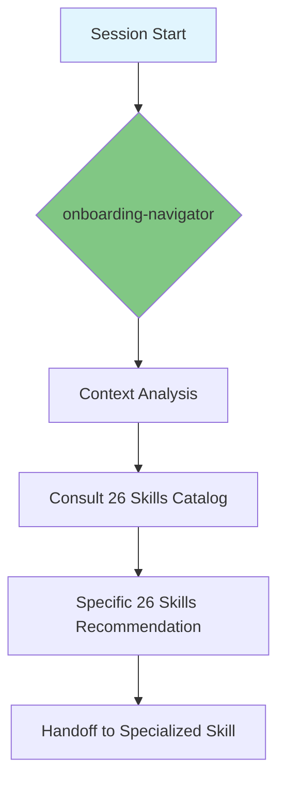

# Onboarding Navigator

> "To navigate with precision, you need to know the map." — This skill is the authoritative guide for all 26 abilities and standards in this repository.

---

## 🔒 Prerequisites (Mandatory)
This skill operates WITHIN the **SDD** framework. Before starting any technical execution:
1. **Context Check**: Did you rehydrate the context by reading `STATE.md`, `MEMORY.md`, and `LEARNINGS.md`?
2. **Spec Check**: Does the `spec.md` file exist with clear requirements and Acceptance Criteria (ACs)? (BDD mandatory for Medium+).
3. **Plan Check**: Does the `plan.md` file define the architecture, schemas, and include **Mermaid** diagrams?
4. **Contract Check**: Was the `contract.md` file established with validation sensors?
5. **Task Check**: Is the task list in `tasks.md` detailed and atomized?

---

## 🔒 Mandatory Tooling
The use of **HB CLI** is **MANDATORY** for this skill:
- **Context Hydration**: Use `hb harness rehydrate` to instantly rehydrate the operational triad (State, Memory, Learnings).
- **Health Check**: Run `hb harness audit --deep` to diagnose and fix missing ecosystem components.
- **Skill Scaffolding**: Recommend `hb skill new` when a user wants to create a new ability.
- **Session Handoff**: Use `hb harness handoff` before closing any session to ensure continuity.

---
## Goal

Act as the main entry point and continuous guide for the Skills Hub. The mission is to guide the agent and the user on which ability to use for each problem, ensure alignment with engineering culture (KISS, SDD), and facilitate navigation through all local documentation.

## Output Structure

Execution of this skill results in the following artifacts:

| Artifact | Format | Description |
|----------|---------|-----------|
| **Skill Roadmap** | `.md` | Suggested sequence of skills to solve the problem. |
| **Decision Draft** | `.md` (ADR/RFC) | Reasoned sketch of a technical decision. |
| **Checklist** | `.md` | Plan of initial steps for onboarding or feature. |
| **Ecosystem Map** | `.md` with Mermaid | Visual diagram of the skills ecosystem. |

## Quality Rules

- **Local-First**: Always prioritize documentation contained in this repository and the skills catalog.
- **Decision-Support**: Never just "choose", but guide the choice process through diagnostic questions.
- **Pedagogical**: Explain the reason for each recommended pattern or skill.
- **Mermaid-Enabled**: Use visual visualization to explain onboarding or decision-making flows.
- **Stats-Aware**: Always mention the total number of skills (26) and their categories.
- **Token-Efficient**: Always verify the current operating mode (`.hub-mode`) and apply the appropriate token density via `token-distiller`.

## Prohibited

- **NEVER** ignore the existence of an already implemented skill when suggesting a solution.
- **NEVER** reference non-existent external files in the local repository without context.
- **NEVER** start a large-scale task without validating cultural alignment in this skill.
- **NEVER** forget to consult `MEMORY.md` and `LEARNINGS.md` for previous lessons.

---

## 📊 Ecosystem Overview

---

## 🔄 Workflow (4 Phases)

### Phase 1: 🎪 WELCOME — Welcome and Mapping
1.  **Survey the Terrain**: Identify the repository's current state and session goals.
2.  **Present the Hub**: Use `references/skills-catalog.md` to provide an overview of the **26 available abilities** with Mermaid diagrams.
3.  **Session Boot (Token Optimization)**: Read the `.hub-mode` file and activate the corresponding mode via `token-distiller`. Suggest **Low Token** mode for simple tasks detected in bootstrap.
4.  **Start Checklist**: Suggest initial actions based on user needs.

### Phase 2: 🔍 EXPLORE — Skills Catalog
1.  **Need Match**: Recommend the correct skill based on technical context, using the **Decision Matrix**.
2.  **Navigation Guide**: Explain the structure of the `.specs/` folder and where project memory resides (STATE.md, MEMORY.md, LEARNINGS.md).
3.  **Visualization**: Generate Mermaid diagrams to explain module hierarchy and workflows.

### Phase 3: 🤔 DECIDE — Decision Support
1.  **Skynet Diagnosis**: Apply the decision framework for new technologies or architectures.
2.  **Value Alignment**: Ensure proposals respect simplicity and methodological rigor.
3.  **ADR/RFC Structuring**: Assist in creating decision records following the `architecture` skill.

### Phase 4: ✅ ALIGN — Global Consistency
1.  **Standards Check**: Validate if plans follow Clean Code standards and mandatory **SDD** for development.
2.  **Cultural Mentorship**: Remind of "Simplicity at Scale" and "Rigor when needed" principles.
3.  **Skill Handoff**: Delegate execution to the specialized skill identified in Phase 2, ensuring the cycle starts with **SDD**.
4.  **Session Exit Gate**: Before finishing, validate that every task marked as completed has its corresponding commit and that tests passed (100%).

---

## 📏 Quality Rules

- **Local-First**: Always prioritize documentation contained in this repository and the skills catalog.
- **Decision-Support**: Never just "choose", but guide the choice process through diagnostic questions.
- **Pedagogical**: Explain the reason for each recommended pattern or skill.
- **Mermaid-Enabled**: Use visual visualization to explain onboarding or decision-making flows.
- **Stats-Aware**: Always mention the total number of skills (26) and their categories.

## 🚫 Prohibited

- **NEVER** ignore the existence of an already implemented skill when suggesting a solution.
- **NEVER** reference non-existent external files in the local repository without context.
- **NEVER** start a large-scale task without validating cultural alignment in this skill.
- **NEVER** forget to consult `MEMORY.md`, `LEARNINGS.md`, and the **Context Graph** (`DECISIONS.md`) for previous lessons.
- **NEVER** allow the start of a construction or development without the **SDD** framework.
- **NEVER** end a session without auditing if all task commits (`tasks.md`) were made following the `git-workflow`.

---

## 📚 Reference Documentation

1. **[Skills Catalog](references/skills-catalog.md)** — The authoritative map of the hub's 26 abilities with Mermaid diagrams.
2. **[Decision Making Framework](references/decision-making-framework.md)** — How to choose and document technologies.
3. **[Project Structure Guide](references/project-structure-guide.md)** — The local folder map.
4. **[Onboarding Checklists](references/onboarding-checklists.md)** — Practical action plans.

---

## 📋 Output Structure

Execution of this skill results in the following artifacts:

| Artifact | Format | Description |
|----------|---------|-----------|
| **Skill Roadmap** | `.md` | Suggested sequence of skills to solve the problem. |
| **Decision Draft** | `.md` (ADR/RFC) | Reasoned sketch of a technical decision. |
| **Checklist** | `.md` | Plan of initial steps for onboarding or feature. |
| **Ecosystem Map** | `.md` with Mermaid | Visual diagram of the skills ecosystem. |

---

## 🔄 Update Flow

This skill **MUST** be updated whenever:
1. A new skill is added to the hub
2. Existing skill versions are updated
3. New architecture standards are established
4. Lessons learned (LEARNINGS.md) are documented
