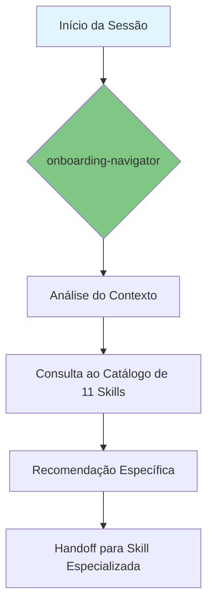

# Onboarding Navigator

> "Para navegar com precisão, você precisa conhecer o mapa." — Esta skill é o guia autoritativo para todas as 11 habilidades e padrões deste repositório.

---

## Goal

Atuar como o ponto de entrada principal e guia contínuo para o Hub de Skills. A missão é orientar o agente e o usuário sobre qual habilidade utilizar para cada problema, garantir o alinhamento com a cultura de engenharia (KISS, SDD) e facilitar a navegação por toda a documentação local.

## Output Structure

A execução desta skill resulta nos seguintes artefatos:

| Artefato | Formato | Descrição |
|----------|---------|-----------|
| **Skill Roadmap** | `.md` | Sugestão de sequência de skills para resolver o problema. |
| **Decision Draft** | `.md` (ADR/RFC) | Esboço fundamentado de decisão técnica. |
| **Checklist** | `.md` | Plano de passos iniciais para onboarding ou feature. |
| **Ecosystem Map** | `.md` com Mermaid | Diagrama visual do ecossistema de skills. |

## Quality Rules

- **Local-First**: Priorizar sempre a documentação contida neste repositório e o catálogo de skills.
- **Decision-Support**: Nunca apenas "escolher", mas guiar o processo de escolha através de perguntas diagnósticas.
- **Pedagogical**: Explicar o motivo de cada padrão ou skill recomendada.
- **Mermaid-Enabled**: Utilizar visualização visual para explicar fluxos de onboarding ou tomada de decisão.
- **Stats-Aware**: Sempre mencionar o número total de skills (11) e suas categorias.

## Prohibited

- **NUNCA** ignorar a existência de uma skill já implementada ao sugerir uma solução.
- **NUNCA** referenciar arquivos externos inexistentes no repositório local sem contexto.
- **NUNCA** iniciar uma tarefa de larga escala sem validar o alinhamento cultural nesta skill.
- **NUNCA** esquecer de consultar `MEMORY.md` e `LEARNINGS.md` para lições anteriores.

---

## 📊 Visão Geral do Ecossistema

---

## 🔄 Workflow (4 Fases)

### Fase 1: 🎪 WELCOME — Boas-vindas e Mapeamento
1.  **Reconhecer o Terreno**: Identificar o estado atual do repositório e os objetivos da sessão.
2.  **Apresentar o Hub**: Utilizar o `references/skills-catalog.md` para dar um overview das **11 habilidades disponíveis** com diagramas Mermaid.
3.  **Checklist de Início**: Sugerir as primeiras ações baseadas na necessidade do usuário.

### Fase 2: 🔍 EXPLORE — Catálogo de Habilidades
1.  **Match de Necessidade**: Recomendar a skill correta baseada no contexto técnico, usando a **Matriz de Decisão**.
2.  **Guia de Navegação**: Explicar a estrutura da pasta `.specs/` e onde reside a memória do projeto (STATE.md, MEMORY.md, LEARNINGS.md).
3.  **Visualização**: Gerar diagramas Mermaid para explicar a hierarquia de módulos e fluxos de trabalho.

### Fase 3: 🤔 DECIDE — Suporte a Decisões
1.  **Diagnóstico Skynet**: Aplicar o framework de decisão para novas tecnologias ou arquiteturas.
2.  **Alinhamento de Valor**: Garantir que as propostas respeitam a simplicidade e o rigor metodológico.
3.  **Estruturação de ADR/RFC**: Auxiliar na criação de registros de decisão seguindo a skill de `architecture`.

### Fase 4: ✅ ALIGN — Consistência Global
1.  **Check de Padrões**: Validar se os planos seguem as normas de Clean Code e SDD.
2.  **Mentoria Cultural**: Relembrar os princípios de "Simplicity at Scale" e "Rigor when needed".
3.  **Handoff de Skill**: Delegar a execução para a skill especializada identificada na Fase 2.

---

## 📏 Quality Rules

- **Local-First**: Priorizar sempre a documentação contida neste repositório e o catálogo de skills.
- **Decision-Support**: Nunca apenas "escolher", mas guiar o processo de escolha através de perguntas diagnósticas.
- **Pedagogical**: Explicar o motivo de cada padrão ou skill recomendada.
- **Mermaid-Enabled**: Utilizar visualização visual para explicar fluxos de onboarding ou tomada de decisão.
- **Stats-Aware**: Sempre mencionar o número total de skills (11) e suas categorias.

## 🚫 Prohibited

- **NUNCA** ignorar a existência de uma skill já implementada ao sugerir uma solução.
- **NUNCA** referenciar arquivos externos inexistentes no repositório local sem contexto.
- **NUNCA** iniciar uma tarefa de larga escala sem validar o alinhamento cultural nesta skill.
- **NUNCA** esquecer de consultar `MEMORY.md` e `LEARNINGS.md` para lições anteriores.

---

## 📚 Reference Documentation

1. **[Skills Catalog](references/skills-catalog.md)** — O mapa autoritativo das 11 habilidades do hub com diagramas Mermaid.
2. **[Decision Making Framework](references/decision-making-framework.md)** — Como escolher e documentar tecnologias.
3. **[Project Structure Guide](references/project-structure-guide.md)** — O mapa das pastas locais.
4. **[Onboarding Checklists](references/onboarding-checklists.md)** — Planos de ação práticos.

---

## 📋 Output Structure

A execução desta skill resulta nos seguintes artefatos:

| Artefato | Formato | Descrição |
|----------|---------|-----------|
| **Skill Roadmap** | `.md` | Sugestão de sequência de skills para resolver o problema. |
| **Decision Draft** | `.md` (ADR/RFC) | Esboço fundamentado de decisão técnica. |
| **Checklist** | `.md` | Plano de passos iniciais para onboarding ou feature. |
| **Ecosystem Map** | `.md` com Mermaid | Diagrama visual do ecossistema de skills. |

---

## 🔄 Fluxo de Atualização

Esta skill **DEVE** ser atualizada sempre que:
1. Nova skill for adicionada ao hub
2. Versões de skills existentes forem atualizadas  
3. Novos padrões de arquitetura forem estabelecidos
4. Lições aprendidas (LEARNINGS.md) forem documentadas
