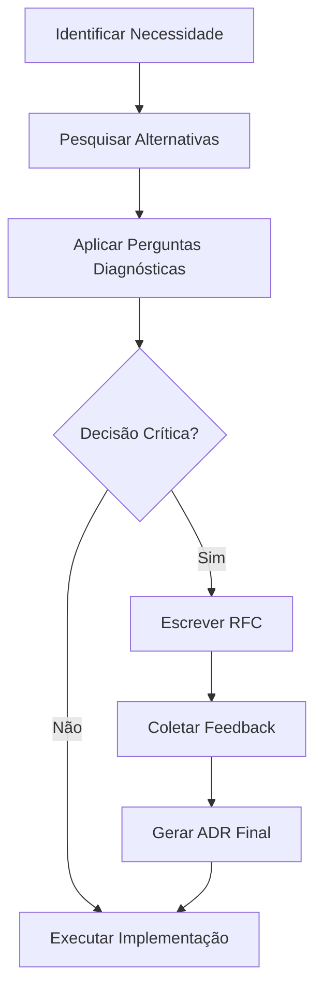

# Technical Decision Making Framework

Este guia fornece o roteiro para avaliar e documentar decisões técnicas críticas no projeto, garantindo que a cultura de simplicidade e rigor seja mantida.

---

## 1. Quando uma Decisão Exige Formalização?
Uma decisão deve ser documentada via **RFC (Request for Comments)** ou **ADR (Architecture Decision Record)** quando:
- Introduz uma nova tecnologia ou biblioteca.
- Altera a estrutura fundamental do sistema (ex: mudar de REST para GraphQL).
- Impacta múltiplos times ou módulos.
- Define um novo padrão de codificação ou segurança.

## 2. Perguntas Diagnósticas (Cultura Skynet)
Antes de decidir, responda:
1.  **Escalabilidade**: Esta solução suporta o aumento esperado de carga? (Consulte a skill `architecture`).
2.  **Manutenção**: Quem cuidará disso daqui a 6 meses? É uma tecnologia de mercado ou algo obscuro?
3.  **Simplicidade (KISS)**: Existe uma forma de fazer isso sem adicionar uma nova dependência?
4.  **Custo**: Qual o impacto no orçamento de infraestrutura ou tempo de desenvolvimento?
5.  **Reversibilidade**: Se descobrirmos que esta foi uma escolha errada, quão difícil é voltar atrás?

## 3. O Processo de Decisão

## 4. Estrutura do ADR (Architecture Decision Record)
Utilize o template oficial na pasta `.specs/architecture/`:
- **Status**: Proposed, Accepted, Superceded.
- **Contexto**: O problema que estamos tentando resolver.
- **Decisão**: A solução escolhida.
- **Consequências**: Os trade-offs (positivos e negativos) da escolha.

## 5. Dica do Mentor
"Não escolha a tecnologia que você quer aprender, escolha a tecnologia que o projeto precisa para sobreviver." — Priorize a estabilidade e a facilidade de contratação de novos talentos.
