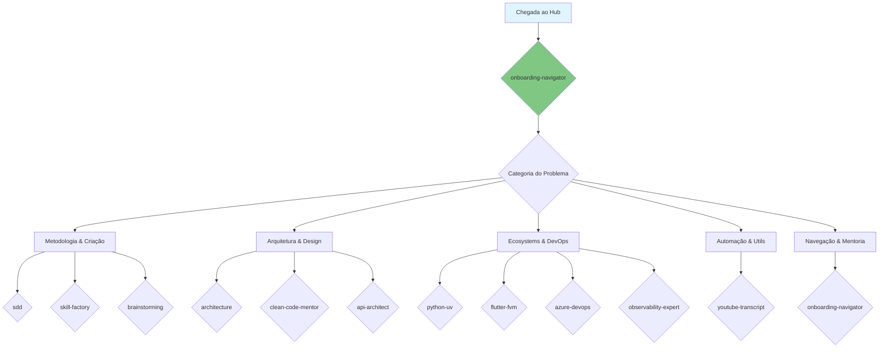
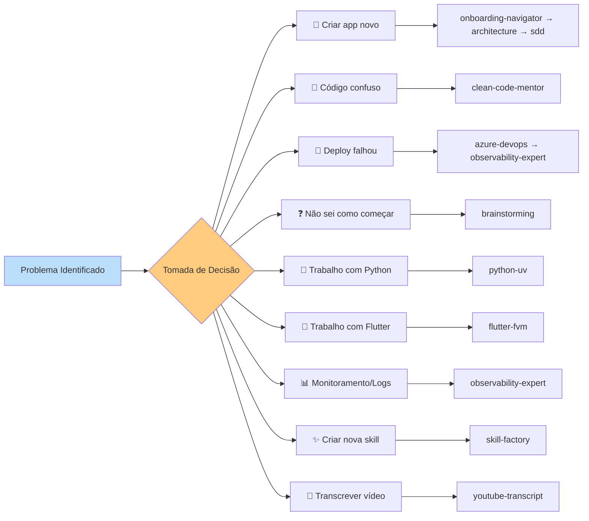

# Skills Catalog: AI Agent Hub

Este guia fornece um overview detalhado de todas as 12 habilidades disponíveis neste repositório, servindo como bússola para o Onboarding Navigator.

## 🗺️ Mapa Visual do Ecossistema de Skills

---

## 📚 Catálogo Completo de Skills (14 Total)

### 1. 🏗️ Core Frameworks (Metodologia e Criação)

| Skill | Versão | Propósito | Quando Invocá-la |
|-------|--------|-----------|------------------|
| **[SDD](sdd/)** | `1.4.0` | Spec-Driven Development. Modular workflow with PRD/RFC, BDD, and Mermaid Diagrams mandate. | **Sempre** que for iniciar uma implementação. |
| **[Skill Factory](skill-factory/)** | `1.1.0` | Core Framework para criação padronizada de novas skills com scaffolding, validação e registro automatizados. | Ao criar ou auditar uma habilidade no hub. |
| **[Brainstorming](brainstorming/)** | `1.1.0` | Facilitador de Brainstorming e Design — guia o agente a explorar problemas complexos, gerar ideias divergentes e convergir para especificações sólidas antes de qualquer implementação. | Antes de qualquer especificação técnica. |
| **[Harness Expert](harness-expert/)** | `1.1.0` | Infraestrutura de suporte para estado, memória de longo prazo e orquestração de agentes via SDD (Spec-Driven Development). | Para manter o contexto persistente e orquestrar subagentes de forma determinística. |
| **[Knowledge Architect](knowledge-architect/)** | `1.0.0` | Arquitetura de conhecimento local via grafos relacionais (Local GraphRAG). | Para mapear relações complexas entre requisitos, decisões e código para navegação de contexto inteligente. |

### 2. 🎨 Architecture & Design (Qualidade e Estrutura)

| Skill | Versão | Propósito | Quando Invocá-la |
|-------|--------|-----------|------------------|
| **[Architecture](architecture/)** | `2.0.1` | Arquiteto de Sistemas — guia o agente a projetar sistemas escaláveis, resilientes e distribuídos (CQRS, Event-Driven) utilizando ADRs, Fitness Functions e Diagramas Mermaid mandatórios para visualização. | Ao desenhar a estrutura macro de um sistema. |
| **[Clean Code Mentor](clean-code-mentor/)** | `1.0.0` | Skill para mentoria técnica e revisão de código com foco total em SOLID, YAGNI, DRY e KISS. Identifica violações de design e sugere refatorações para código mais simples e mantível. | Durante revisões de código ou refatorações. |
| **[API Architect](api-architect/)** | `1.3.0` | Arquiteto de APIs — guia o agente a projetar sistemas de API interoperáveis, seguros e resilientes, definindo contratos e padrões de governança. | Ao projetar endpoints e integrações. |

### 3. ⚙️ Ecosystems & DevOps (Ambientes e Automação)

| Skill | Versão | Propósito | Quando Invocá-la |
|-------|--------|-----------|------------------|
| **[Python com UV](python-uv/)** | `2.5.0` | Skill para desenvolvimento Python profissional com UV. Use quando precisar inicializar projetos (Django Pro, FastAPI, CLI), gerenciar dependências, versões Python, ambientes virtuais, ferramentas de desenvolvimento (ruff, mypy, pytest), otimizar performance (Django N+1), executar scripts inline (PEP 723), configurar CI/CD, ou migrar para UV. | Em qualquer tarefa envolvendo Python. |
| **[Flutter com FVM](flutter-fvm/)** | `1.1.0` | Skill para desenvolvimento Flutter profissional com FVM (Flutter Version Management). Use quando precisar gerenciar múltiplas versões do SDK do Flutter por projeto, garantir consistência entre ambientes de desenvolvimento, gerenciar dependências com pubspec.yaml, configurar linting, testes avançados por camada arquitetural, segurança OWASP Mobile Top 10 e builds multiplataforma seguros. | Em qualquer tarefa envolvendo Flutter/Dart. |
| **[Azure DevOps](azure-devops/)** | `1.1.0` | Skill para gerenciamento profissional do Azure DevOps (AzDO). Permite gerenciar Boards, Repos, Pipelines, Artifacts, Governança (Variable Groups, Service Connections) e Administração de forma eficiente. | Para gerenciar tarefas e CI/CD no AzDO. |
| **[Observability Expert](observability-expert/)** | `1.0.0` | Skill para especialista em SRE e Observabilidade. Foca em Logs Estruturados, OpenTelemetry, SLIs/SLOs e monitoramento proativo para garantir a resiliência de sistemas. | Ao garantir que um sistema é monitorável. |

### 4. 🚀 Automation & Utils (Produtividade)

| Skill | Versão | Propósito | Quando Invocá-la |
|-------|--------|-----------|------------------|
| **[YouTube Transcript](youtube-transcript/)** | `1.0.0` | Skill para automatizar a extração de transcrições de vídeos do YouTube com fallback para IA (Whisper) e limpeza automática. | Quando precisar do conteúdo textual de um vídeo do YouTube. |

### 5. 🧭 Navigation & Mentorship

| Skill | Versão | Propósito | Quando Invocá-la |
|-------|--------|-----------|------------------|
| **[Onboarding Navigator](onboarding-navigator/)** | `1.1.0` | Guia mestre do Hub de Skills. Fornece overview de todas as habilidades locais, mentoria cultural e suporte à navegação técnica no ecossistema do projeto. | **No início da sessão** para entender o hub. |

---

## 🧠 Matriz de Decisão: Qual Skill usar?

---

## 📈 Estatísticas do Hub

- **Total de Skills**: 14
- **Skills de Metodologia**: 5
- **Skills de Arquitetura**: 3  
- **Skills de DevOps**: 4
- **Skills de Automação**: 1
- **Skills de Navegação**: 1
- **Última Atualização**: 16 de Abril de 2026

