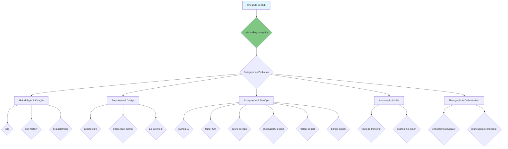
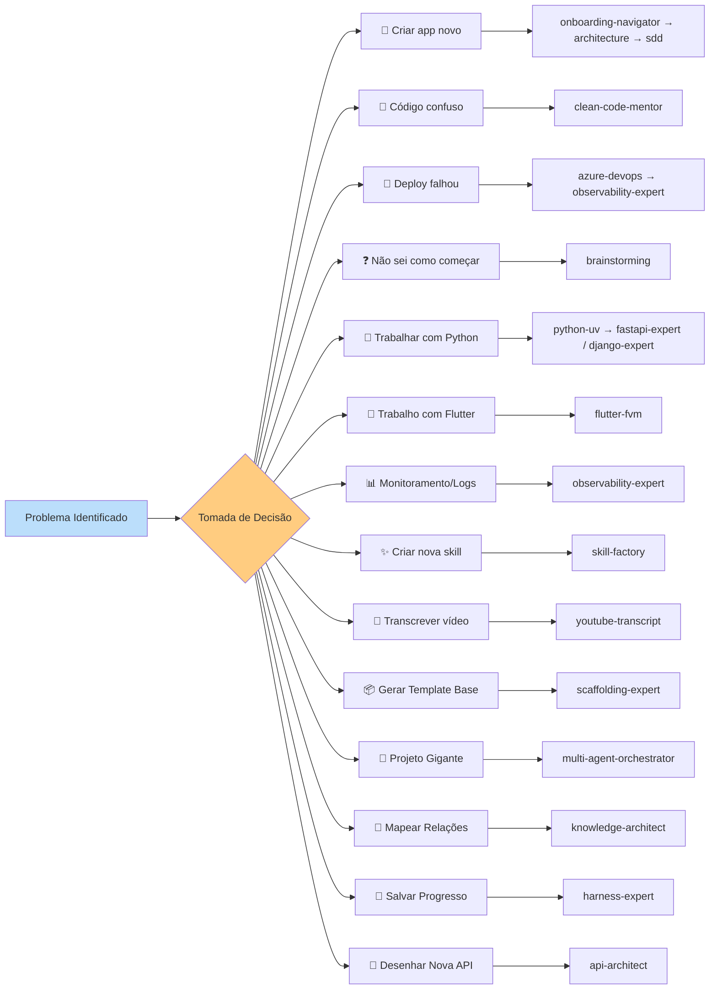

# Skills Catalog: AI Agent Hub

Este guia fornece um overview detalhado de todas as 18 habilidades disponíveis neste repositório, servindo como bússola para o Onboarding Navigator.

## 🗺️ Mapa Visual do Ecossistema de Skills

---

## 📚 Catálogo Completo de Skills (18 Total)

### 1. 🏗️ Core Frameworks (Metodologia e Criação)

| Skill | Versão | Propósito | Quando Invocá-la |
|-------|--------|-----------|------------------|
| **[SDD](sdd/)** | `1.4.0` | Spec-Driven Development. Modular workflow with PRD/RFC, BDD, and Mermaid Diagrams mandate. | **Sempre** que for iniciar uma implementação. |
| **[Skill Factory](skill-factory/)** | `1.1.0` | Core Framework para criação padronizada de novas skills com scaffolding, validação e registro automatizados. | Ao criar ou auditar uma habilidade no hub. |
| **[Brainstorming](brainstorming/)** | `1.1.0` | Facilitador de Brainstorming e Design — guia o agente a explorar problemas complexos. | Antes de qualquer especificação técnica. |
| **[Harness Expert](harness-expert/)** | `1.1.0` | Infraestrutura de suporte para estado, memória de longo prazo e orquestração via SDD. | Para manter o contexto persistente. |
| **[Knowledge Architect](knowledge-architect/)** | `1.0.0` | Arquitetura de conhecimento local via grafos relacionais (Local GraphRAG). | Para mapear relações complexas. |

### 2. 🎨 Architecture & Design (Qualidade e Estrutura)

| Skill | Versão | Propósito | Quando Invocá-la |
|-------|--------|-----------|------------------|
| **[Architecture](architecture/)** | `2.0.1` | Arquiteto de Sistemas — projeta sistemas escaláveis, resilientes e distribuídos via ADRs. | Ao desenhar a estrutura macro de um sistema. |
| **[Clean Code Mentor](clean-code-mentor/)** | `1.0.0` | Mentoria técnica e revisão de código com foco em SOLID, YAGNI, DRY e KISS. | Durante revisões de código ou refatorações. |
| **[API Architect](api-architect/)** | `1.3.0` | Arquiteto de APIs — projeta sistemas interoperáveis e seguros. | Ao projetar endpoints e integrações. |

### 3. ⚙️ Ecosystems & DevOps (Ambientes e Automação)

| Skill | Versão | Propósito | Quando Invocá-la |
|-------|--------|-----------|------------------|
| **[Python com UV](python-uv/)** | `2.5.0` | Desenvolvimento Python profissional com UV. | Em tarefas macro envolvendo Python. |
| **[FastAPI Expert](fastapi-expert/)** | `1.0.0` | Desenvolvimento avançado de APIs assíncronas com FastAPI e Pydantic. | Ao codificar rotas e schemas FastAPI. |
| **[Django Expert](django-expert/)** | `1.0.0` | Desenvolvimento robusto com Django, focado em ORM e HTMX. | Ao trabalhar com aplicações Django. |
| **[Flutter com FVM](flutter-fvm/)** | `1.1.0` | Desenvolvimento Flutter profissional com FVM. | Em qualquer tarefa envolvendo Flutter/Dart. |
| **[Azure DevOps](azure-devops/)** | `1.1.0` | Gerenciamento profissional do Azure DevOps (AzDO). | Para gerenciar tarefas e CI/CD no AzDO. |
| **[Observability Expert](observability-expert/)** | `1.0.0` | Especialista em SRE e Observabilidade (OTel, Logs Estruturados). | Ao garantir que um sistema é monitorável. |

### 4. 🚀 Automation & Utils (Produtividade)

| Skill | Versão | Propósito | Quando Invocá-la |
|-------|--------|-----------|------------------|
| **[YouTube Transcript](youtube-transcript/)** | `1.0.0` | Automatizar a extração de transcrições de vídeos do YouTube. | Quando precisar de conteúdo de um vídeo. |
| **[Scaffolding Expert](scaffolding-expert/)** | `1.0.0` | Geração dinâmica de templates via CLI (copier/cookiecutter). | Para gerar um novo projeto do zero. |

### 5. 🧭 Navigation & Orchestration

| Skill | Versão | Propósito | Quando Invocá-la |
|-------|--------|-----------|------------------|
| **[Onboarding Navigator](onboarding-navigator/)** | `1.1.0` | Guia mestre do Hub de Skills. Fornece overview e mentoria. | **No início da sessão** para entender o hub. |
| **[Multi-Agent Orchestrator](multi-agent-orchestrator/)** | `1.0.0` | Coreografia de equipes de agentes (Arquiteto, Dev, QA) e handoff. | Em grandes épicos que requerem vários agentes. |

---

## 🧠 Matriz de Decisão: Qual Skill usar?

---

## 📈 Estatísticas do Hub

- **Total de Skills**: 19
- **Skills de Metodologia**: 5
- **Skills de Arquitetura**: 3  
- **Skills de DevOps/Frameworks**: 7
- **Skills de Automação**: 2
- **Skills de Navegação/Orquestração**: 2
- **Última Atualização**: 19 de Abril de 2026

