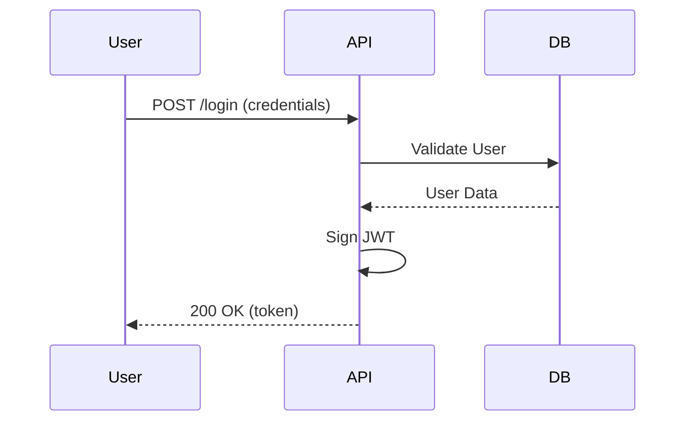

# Gold Standard Output: SDD Execution

## 1. Spec Analysis (spec.md)
The agent generated a clear specification with Acceptance Criteria in BDD:

```markdown
### AC-1: Token Generation
**Given** that the user provides valid credentials
**When** the /login route is called
**Then** a JWT token must be returned with 1h expiration.
```

## 2. Technical Design (plan.md)
The plan includes a Mermaid sequence diagram:



## 3. Rationale
This output is Gold Standard because:
- Correctly follows **Auto-Sizing** (Medium).
- Uses **BDD** for acceptance criteria.
- Includes visualization via **Mermaid**.
- Breaks down tasks **atomically** in `tasks.md`.
