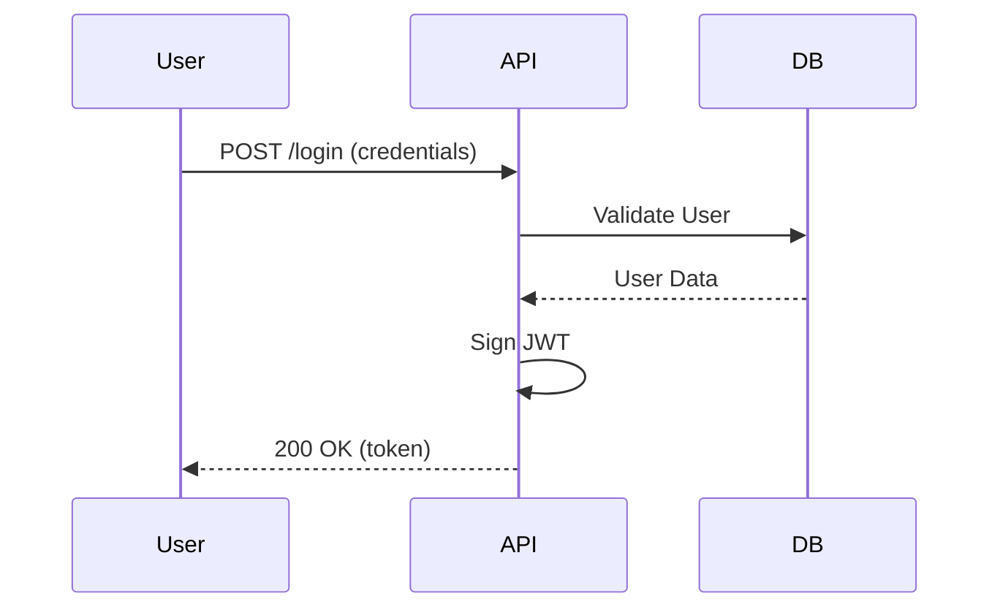

# Gold Standard Output: SDD Execution

## 1. Spec Analysis (spec.md)
O agente gerou uma especificação clara com Critérios de Aceitação em BDD:

```markdown
### AC-1: Geração de Token
**Given** que o usuário forneça credenciais válidas
**When** a rota /login for chamada
**Then** um token JWT deve ser retornado com expiração de 1h.
```

## 2. Technical Design (plan.md)
O plano inclui um diagrama Mermaid de sequência:



## 3. Rationale
Este output é Gold Standard porque:
- Segue o **Auto-Sizing** corretamente (Medium).
- Utiliza **BDD** para os critérios de aceitação.
- Inclui visualização via **Mermaid**.
- Divide as tarefas de forma **atômica** no `tasks.md`.
