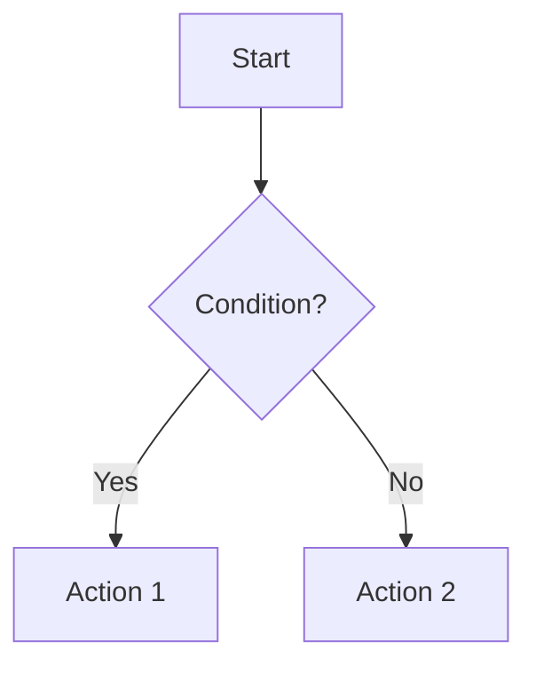

# SDD Specification Template: spec.md

This template follows the **Spec-Driven Development (SDD)** framework. Use it to define the source of truth for any feature or project.

---

## 1. Context & Goals
*Briefly describe what this spec is about and the primary objective.*

- **Problem Statement**: What problem are we solving?
- **Scope**: What is included and what is NOT included.
- **Success Criteria**: How do we know we are done?

## 2. Requirements (BDD Scenarios)
*Define the behavior using Given/When/Then syntax.*

### Feature: [Feature Name]

**Scenario 1: [Short Description]**
- **Given** [Initial Context]
- **When** [Action]
- **Then** [Expected Outcome]

## 3. Architecture & Technical Design
*Describe how the feature will be implemented.*

### Data Structures / Models
- `ModelName`: Description of fields and types.

### API / Interface Contracts
- `Endpoint/Method`: Input parameters and expected output.

### Logic Flow (Mermaid Diagram)

## 4. Implementation Plan (Tasks)
*Break down the work into actionable items.*

- [ ] Task 1: [Description]
- [ ] Task 2: [Description]
- [ ] Task 3: [Verification/Testing]

## 5. Constraints & Risks
- **Security**: [Considerations]
- **Performance**: [Expected limits]
- **Dependencies**: [Required libraries or services]

## 6. Validation Report
*To be filled after implementation.*

- **Test Results**: [Summary of tests passed]
- **Observations**: [Any deviations from the original spec]
